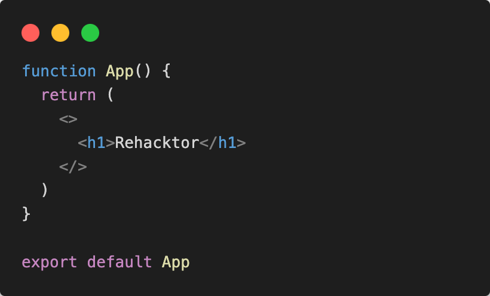

# Setup Rehacktor

## Generazione Vite + React app

Assicuriamoci di essere nella cartella working area o development e lanciamo il comando sul terminale:

```sh
npm create vite@latest
```

Una volta generata la cartella di progetto “rehacktor-specializzazione” o qualsiasi nome abbiate assegnato al progetto entriamo nella cartella di progetto:

```sh
cd rehacktor-specializzazione
```

Installiamo le dipendenze: 

```sh
npm install 
```

Eseguiamo il progetto in dev mode, assicurandoci che tutto funzioni:

```sh
npm run dev 
```

## Installa Style Framework o setup custom CSS

Ci sono varie opzioni a scelta dello studente per il CSS

- Custom CSS modules
- CSS in JS
- Utility Class based CSS
    - Tailwind CSS
    - Bootstrap CSS
- React Component libraries
    - Material UI
    - Chakra UI
    - Shadcn UI
    - React-bootstrap
    - Mantine

## Setup files

Iniziamo creando un basic setup, con un semplice file global.css e un App.jsx component.

Questa sará la nostra struttura di files e cartelle nella cartella src

```.
└─ src/                   # source dir
   ├─ assets/
   ├─ App.jsx
   ├─ global.css
   └─ main.jsx
```

Nel nostro App.jsx questo dovrebbe essere il risultato dopo la semplificazione del file



