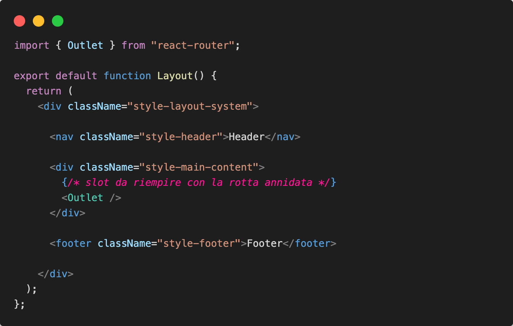
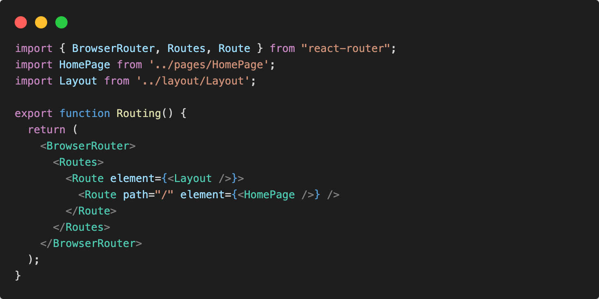
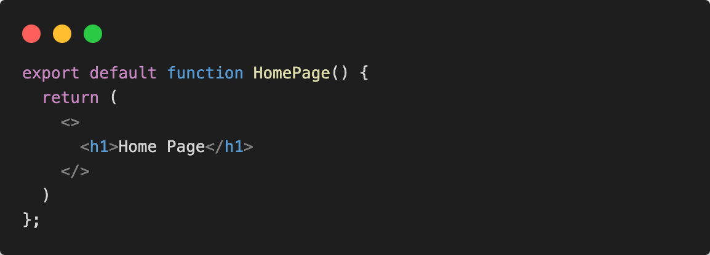
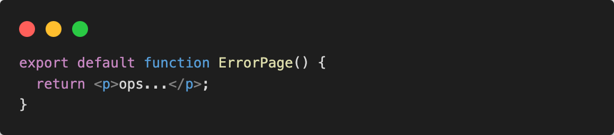
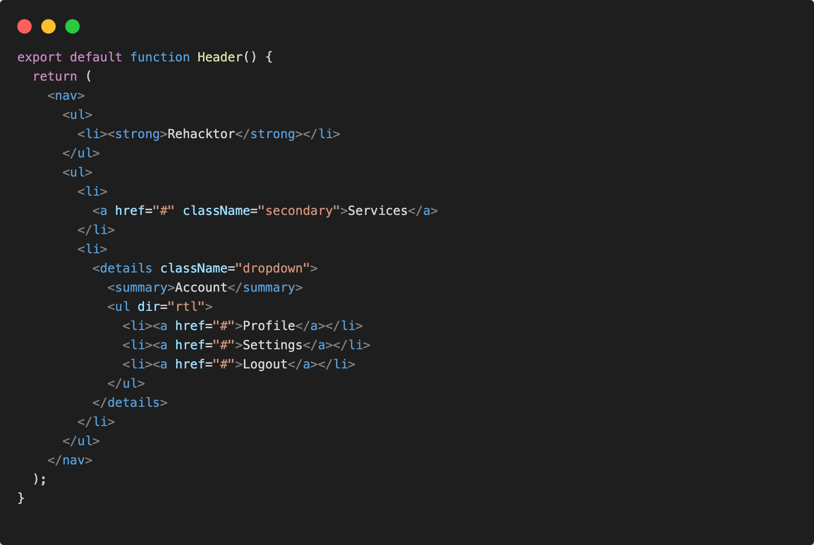
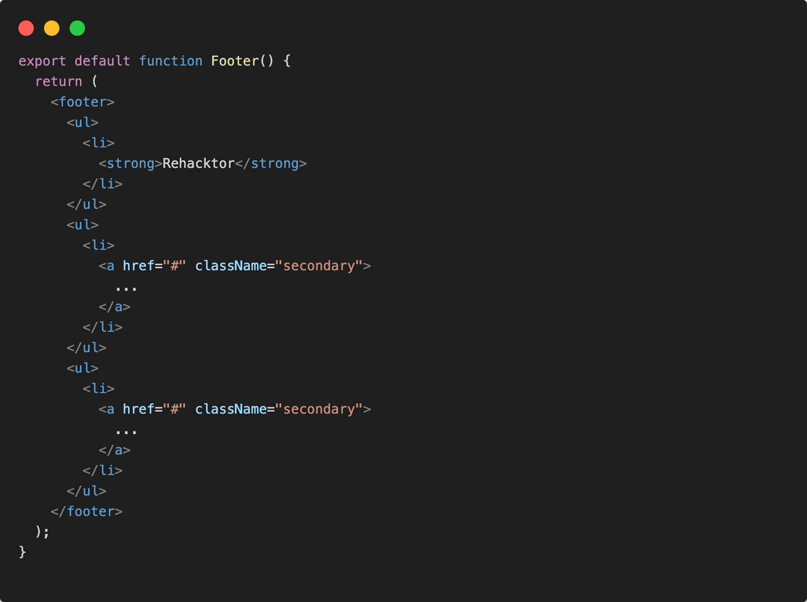
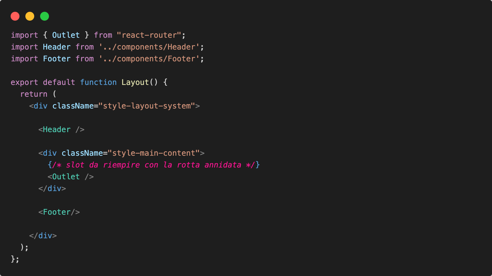

# Scaffolding project

Iniziamo a organizzare una struttura modulare per la creazione delle nostre pagine.

## Install React router

Nella cartella di progetto:

```sh
npm install react-router
```

Dopo aver controllare che ci sia "react-router" tra le nostre dipendenze, creamo il nostro routing system

Creamo la cartella in src routes/ e all'interno un componente Routing.jsx che si occuperá generare le varie rotte. 

```.
└─ src/                   # source dir
   ├─ assets/
   ├─ routes/
      └─ Routing.jsx
   ├─ App.jsx
   ├─ global.css
   └─ main.jsx
```

Ogni pagina avrá probabilmente in comune un layout, dove sará presente una header di navigazione e un footer di informazioni. 

Creamo cosi una cartella per il markup del componente Layout che sará presente in ogni rotta, la carella la chiamo layout/

```.
└─ src/                   # source dir
   ├─ assets/
   ├─ layout/
      └─ Layout.jsx
   ├─ routes/
      └─ Routing.jsx
   ├─ App.jsx
   ├─ global.css
   └─ main.jsx
```

Andiamo a definire il markup del componente Layout.jsx



Usiamo il componente fornito da "react-router" ```<Outlet /> ``` per generare uno slot rempitivo in cui dinamicamente verrá mostrata la pagina in base al path di navigazione.

## Routing system

Andiamo a definire le nostre rotte nel file Routing.jsx, importando il sistema BrowserRouter e usando i componenti ``` <Routes /> <Route />```



Come possiamo notare, creamo la rotta "/" che mostrerá il componente ```<HomePage />```

Andiamo a creare il componente HomePage, per questo obiettivo creo la cartella pages/ dove all'interno verranno inserite tutte le pages components.

Seguiamo anche per le pagine una struttura folder-based
Ogni pagina avrá la sua cartella di riferimento.

```.
└─ src/                   # source dir
    ├─ assets/
    ├─ layout/
      └─ Layout.jsx
    ├─ pages/
      └─ homepage/
        └─ index.jsx
    ├─ routes/
      └─ Routing.jsx
    ├─ App.jsx
    ├─ global.css
    └─ main.jsx
```

In homepage/index.jsx:



Generiamo un'ultima "catch all route" in caso una rotta non esistesse.

```.
└─ src/                   # source dir
    ├─ assets/
    ├─ layout/
      └─ Layout.jsx
    ├─ pages/
      └─ homepage/
        └─ index.jsx
      └─ error/
        └─ index.jsx
    ├─ routes/
      └─ Routing.jsx
    ├─ App.jsx
    ├─ global.css
    └─ main.jsx
```

Aggiungo una rotta come abbiamo fatto per "/"

```jsx
<Route path="*" element={<ErrorPage />} />
```

In error/index.jsx:



## Components folder

Per terminare lo scaffolding principale, creamo una cartella per i componenti UI ricorrenti nella nostra applicazione.

Componenti UI:
- Header
- Footer
- Sidebar
- Card

```.
└─ src/                   # source dir
    ├─ assets/
    ├─ layout/
      └─ Layout.jsx
    ├─ components/
      ├─ Header.jsx
      ├─ Footer.jsx
      ├─ Sidebar.jsx
      └─ Card.jsx
    ├─ pages/
      └─ homepage/
        └─ index.jsx
      └─ error/
        └─ index.jsx
    ├─ routes/
      └─ Routing.jsx
    ├─ App.jsx
    ├─ global.css
    └─ main.jsx
```

Andiamo a creare i componenti Header.jsx:



e Footer.jsx:



Lasciamo gli altri due componenti piu in avanti.

Ovviamente lasciamo allo studente la stesura di un ricco codice CSS per dare stile a tutti i componenti.

## Markup del Layout component 

Ultimo passo andiamo adesso a riutilizzare i componenti ```<Header />``` e ```<Footer />``` nel componente Layout che fornisce il layout generale e sempre presente in tutte la pagine dell'applicazione.

Nel componente Layout.jsx:

