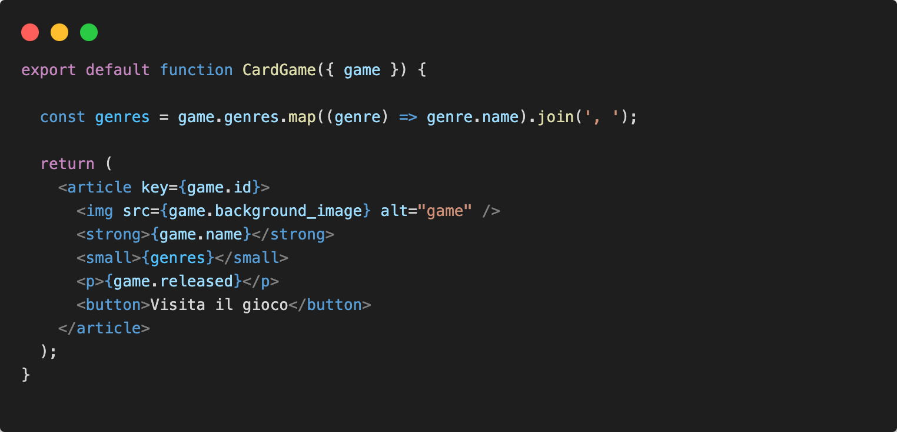
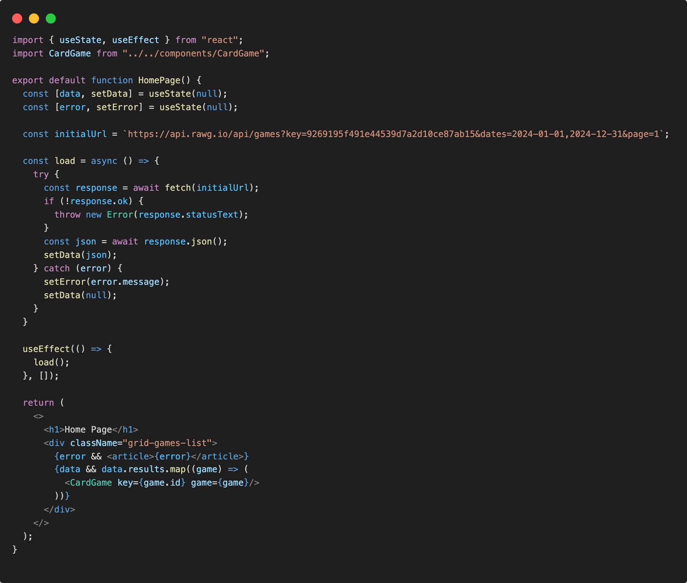
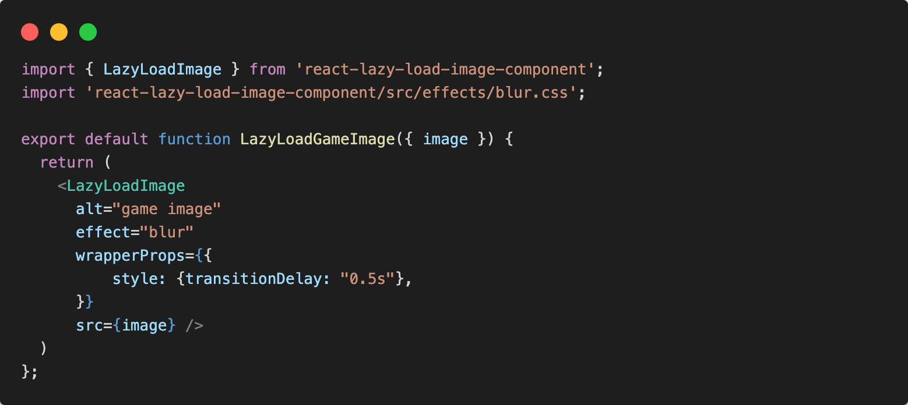
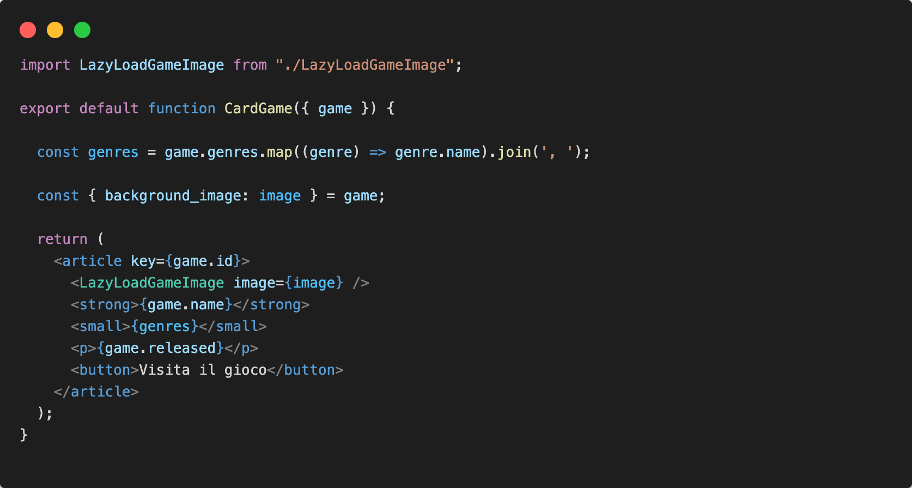
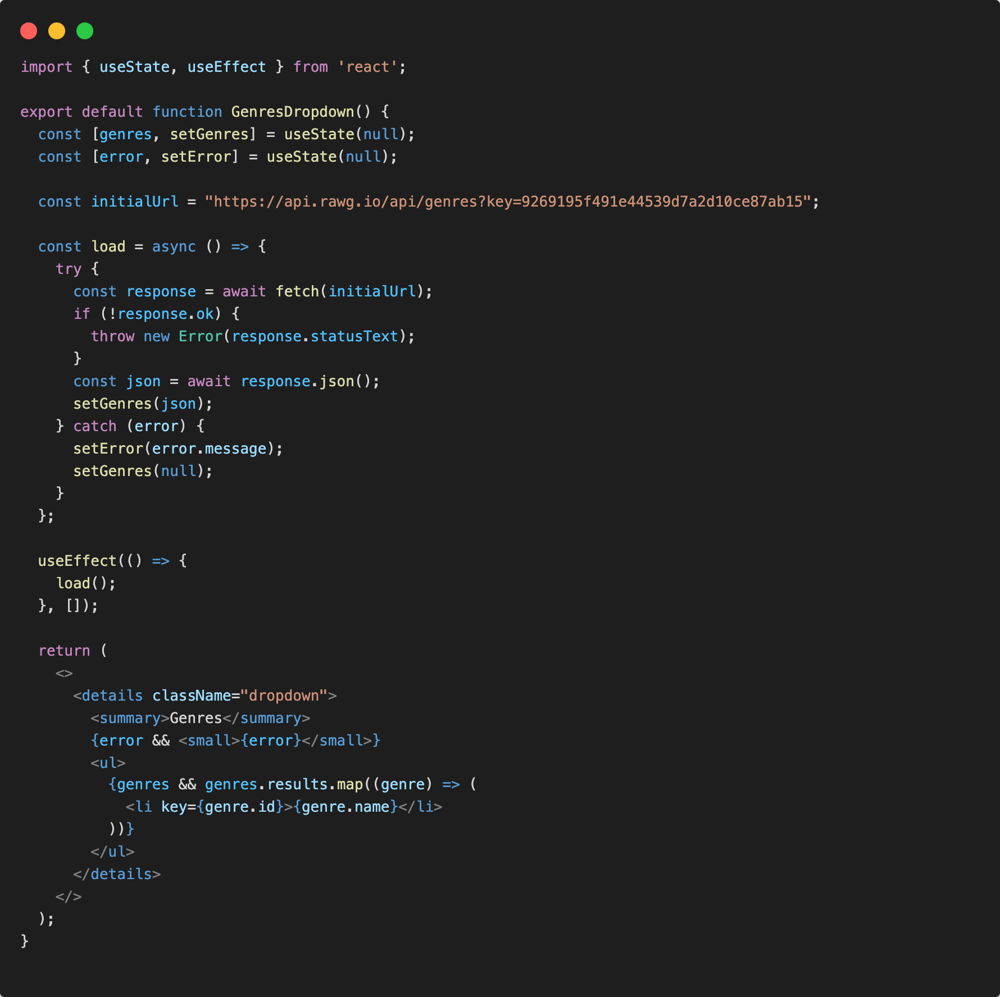

# API Requests

## Initial load data

Iniziamo ad interagire con le nostre rotte API.

Dopo aver creato un profilo alla pagina [https://rawg.io/](https://rawg.io/) e aver generato una propria ```api_key``` , la rotta api che consumeremo nella home page avrá questo specifico endpoint:
```https://api.rawg.io/api/games?key=INSERISCI_KEY&dates=2024-01-01,2024-12-31&page=1```

Nel componente ```<HomePage />``` eseguiremo la fetch attraverso l'hook react ```useEffect``` e useremo lo state del componente per visualizzare nella UI i risultati di risposta.

Creamo gli stati nel componente per fare store dei risultati:

```jsx

const [data, setData] = useState(null);
const [error, setError] = useState(null);

```

Creamo la funzione di caricamento dei dati:

```jsx
const load = async () => {
    try {
      const response = await fetch(initialUrl);
      if (!response.ok) {
        throw new Error(response.statusText);
      }
      const json = await response.json();
      setData(json);
    } catch (error) {
      setError(error.message);
      setData(null);
    }
  }
```

Sincronizziamo la funzione di caricamento al primo montaggio del componente ```<HomePage />``` con ```useEffect```:

```jsx
useEffect(() => {
  load();
}, []);
```

Infine Mostriamo i dati di risposta nella UI attraverso il JSX.

## UI components

Per semplificare la struttura del JSX in ```<HomePage />``` creo contestualmente un componente per la card del singolo gioco mostrato, in modo da poterci lavorare sullo stile e su eventuali features future.

Nella cartella components/ creo un componente ```<CardGame />```, dopo aver definito il markup del componente e il suo stile, utilizzeremo i dati da ```<HomePage />``` per popolare il markup. Questi dati arriveranno a ```<CardGame />``` mediante delle ```props```.

Mostriamo nella UI:



## Render Data

Infine mostriamo i dati mediante l'uso del componente UI ```<CardGame />``` nel componente ```<HomePage />```, ecco come dovrebbe essere il risultato finale dopo il refactoring:



## Optimizing Lazy Load Image

Per il caricamento delle immagine sulla Card del Gioco in fase di rendering e per migliore la qualitá di visualizzazione di queste ultime, usiamo una libreria di lazy loading. 

Nella cartella di progetto installiamo ```react-lazy-load-image-component```

```sh
npm install react-lazy-load-image-component
```

Nella cartella components/ creo un nuovo componente LazyLoadGameImage.jsx che userá la libreria di ottimizzazione di caricamento dell'immgine in modo da rendere la nostra UI piú fluida.

In LazyLoadGameImage.jsx:



Nel componente CardGame.jsx sostituiamo al tag `````` il nostro componente di lazy load:



Ricordiamo allo studente di arricchire il design di ogni componente in modo adeguato e gradevole all'utente.

## Load data category

Introduciamo adesso un dropdown (qualsiasi componente UI a discrezione dello studente) con possibili filtri per genere di gioco all'interno della nostra UI.

Creamo nella cartella components/ il componente GenresDropdown.jsx che si occuperá della visualizzazione dei generi.

Una volta creato il componente GenresDropdown.jsx andiamo ad eseguire il caricamento dei generi facendo una fetch sull'endpoint dei generi presenti.

Endpoint per i generi: ```https://api.rawg.io/api/genres?key=INSERISCI_KEY```

Nel componente GenresDropdown.jsx, usiamo lo state per conservare i dati di risposta:

```jsx
const [genres, setGenres] = useState([]);
```

Creamo la funzione di caricamento dei dati:

```jsx
const load = async () => {
    try {
      const response = await fetch(initialUrl);
      if (!response.ok) {
        throw new Error(response.statusText);
      }
      const json = await response.json();
      setGenres(json);
    } catch (error) {
      setError(error.message);
      setGenres(null);
    }
  }
```

Sincronizziamo la funzione di caricamento al primo montaggio del componente ```<GenresDropdown />``` con ```useEffect```:

```jsx
useEffect(() => {
  load();
}, []);
```

Infine Mostriamo i dati di risposta nella UI attraverso il JSX.



## Render Genres

In ultimo richiamiamo il componente GenresDropdown.jsx nel layout generale in un componente padre Sidebar.jsx che racchiuderá altri eventuali filtri.

Costruiamo Sidebar.jsx sempre nella cartella components/

In layout.jsx richiamiamo ```<Sidebar />```:

```jsx
export default function Layout() {
  return (
    <div className="style-layout-system">

      <Header />

      <div className="style-sidebar-filters">
        <Sidebar />
      </div>

      <div className="style-main-content">
        <Outlet />
      </div>

      <Footer/>

    </div>
  );
};
```

In Sidebar.jsx richiamiamo ```<GenresDropdown />```:

```jsx
import GenresDropdown from "./GenresDropdown";

export default function Sidebar() {
  return (
    <>
      <GenresDropdown />
    </>
  )
}
```
