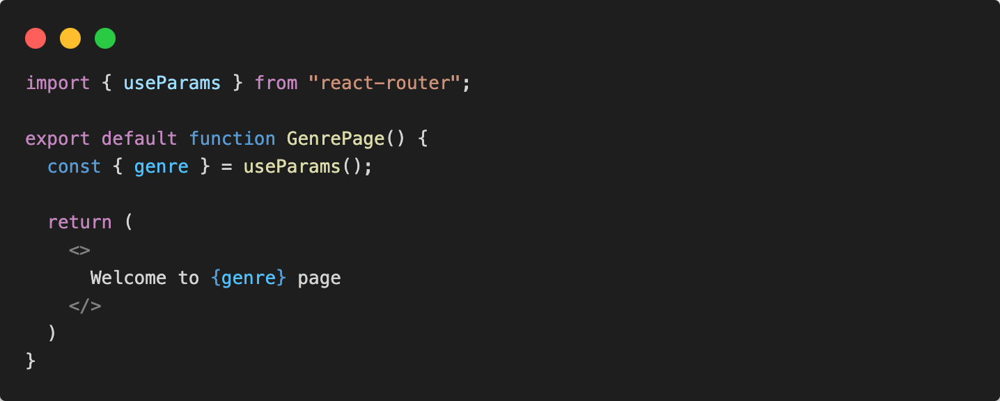
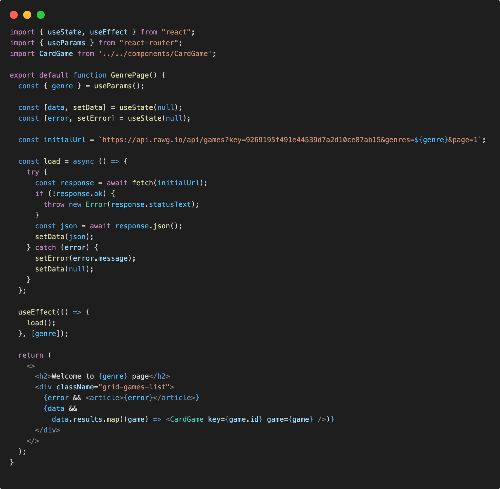
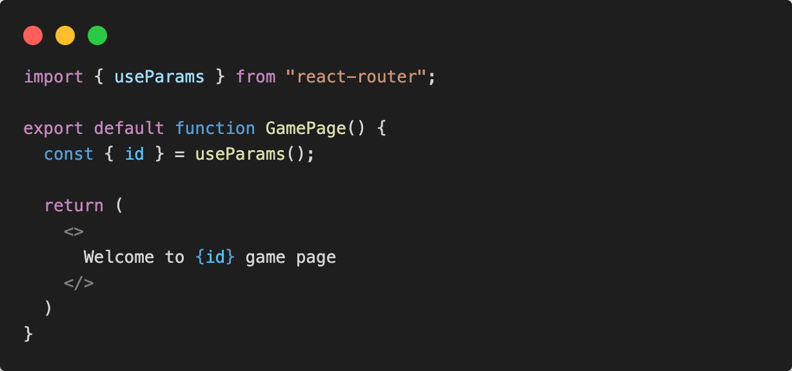
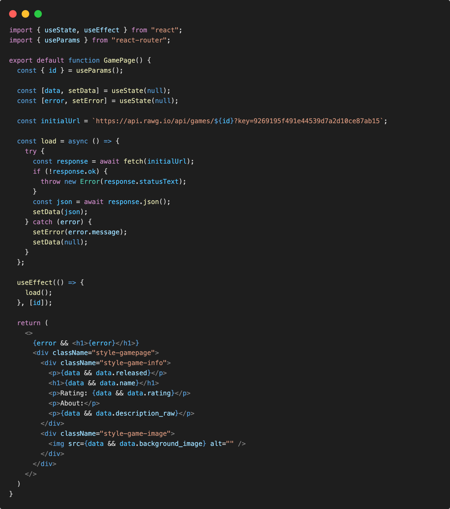

# Dynamic Routes

Creamo la rotta dinamica con react-router che ci consentirá di arrivare sulla pagina di dettaglio del singolo genere cliccato dall'utente.

Aggiungiamo la rotta con il parametro ```/:genre``` in Routing.jsx:

```jsx
<Route path="/games/:genre" element={<GenrePage />} />
```

Il componente da mostrare per la rotta sará ```<GenrePage />```.
Tra le nostre pagine creamo la cartella genrepage/ in cui all'interno definiamo il nostro compoente.

La struttura per le pagine sará la seguente:

```.
└─ src/                   # source dir
    ├─ assets/
    ├─ layout/
    ├─ components/
    ├─ pages/
      └─ homepage/
        └─ index.jsx
      └─ error/
        └─ index.jsx
      └─ genrepage/
        └─ index.jsx
    ├─ routes/
    ├─ App.jsx
    ├─ global.css
    └─ main.jsx
```

## Link to dynamic route /:genre

Sotto ogni genere nel componente ```<GenresDropdown />``` per ogni elemento useremo il componente ```<Link />``` da react-router.

in GenresDropdown.jsx ricodiamoci di importare:

```jsx
import { Link } from 'react-router';
```

e di usare il componente ```<Link />``` e di specificare il path di riferimento, questa volta dinamico:

```jsx
<ul>
  {genres && genres.results.map((genre) => (
    <li key={genre.id}>
      <Link to={`/games/${genre.slug}`}>{genre.name}</Link>
    </li>
  ))}
</ul>
```

## useParams() genre

All'interno di genrepage/index.jsx dovrò catturare il parametro dalla pathname url.

Useremo l'hook di react-router ```useParams()``` per ottenre il parametro.



Dopo aver ottenuto il parametro dovremo fare la fetch dei dati chiamando lo specifico endpoint: ```https://api.rawg.io/api/games?key=9269195f491e44539d7a2d10ce87ab15&genres=${genre}&page=1``` usando il valore ```genre```.

Seguiremo la stessa dinamica usata per gli altri componenti di fetch dei dati al montaggio del componente e render update:



## Dynamic route /:game/:id

Creamo la rotta dinamica con react-router che ci consentirá di arrivare sulla pagina di dettaglio del singolo gioco cliccato dall'utente.

Aggiungiamo la rotta con il parametro ```/:slug/:id``` in Routing.jsx:

```jsx
<Route path="/games/:slug/:id" element={<GamePage />} />
```

Il componente da mostrare per la rotta sará ```<GamePage />```.
Tra le nostre pagine creamo la cartella gamepage/ in cui all'interno definiamo il nostro compoente.

La struttura per le pagine sará la seguente:

```.
└─ src/                   # source dir
    ├─ assets/
    ├─ layout/
    ├─ components/
    ├─ pages/
      └─ homepage/
        └─ index.jsx
      └─ error/
        └─ index.jsx
      └─ genrepage/
        └─ index.jsx
      └─ gamepage/
        └─ index.jsx
    ├─ routes/
    ├─ App.jsx
    ├─ global.css
    └─ main.jsx
```

## Link to dynamic route /:game/:id

Sotto ogni gioco nel componente ```<CardGame />``` per ogni elemento useremo il componente ```<Link />``` da react-router.

in CardGame.jsx ricodiamoci di importare:

```jsx
import { Link } from 'react-router';
```

e di usare il componente ```<Link />``` e di specificare il path di riferimento, questa volta dinamico:

```jsx
<article key={game.id}>
  <LazyLoadGameImage image={image} />
  <strong>{game.name}</strong>
  <small>{genres}</small>
  <p>{game.released}</p>
  <button>
    <Link to={`/games/${game.slug}/${game.id}`}></Link>
  </button>
</article>
```

## useParams() game

All'interno di gamepage/index.jsx dovrò catturare il parametro dalla pathname url.

Useremo l'hook di react-router ```useParams()``` per ottenre il parametro.



Dopo aver ottenuto il parametro dovremo fare la fetch dei dati chiamando lo specifico endpoint: ```https://api.rawg.io/api/games/${id}?key=9269195f491e44539d7a2d10ce87ab15``` usando il valore ```id```.

Seguiremo la stessa dinamica usata per gli altri componenti di fetch dei dati al montaggio del componente e render update:



