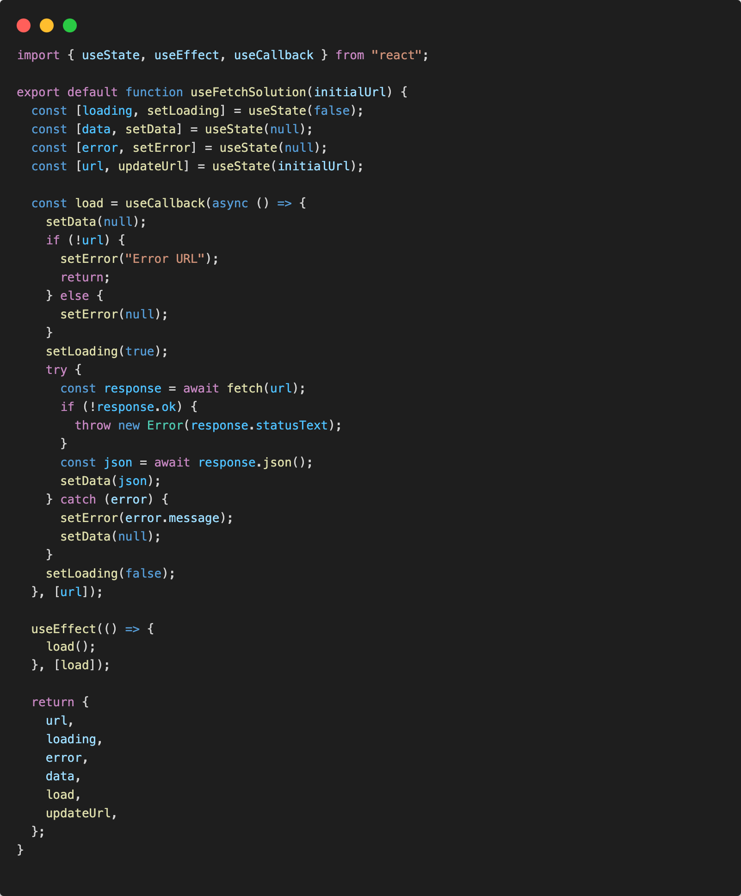

# Custom hook

Per semplificare la struttura dei componenti che usano codice e chiamate asincrone per aggiornare il proprio stato interno, faremo uso di un custom hook ```useFetchSolution```

Nei componenti:

* homepage/index.jsx
* genrepage/index.jsx
* gamepage/index.jsx
* GenresDropdown.jsx

Abbiamo del codice ripetitivo che effettua una fetch a un endpoint con gestione dello stato.

Creamo una cartella per il nostro custom hook, hook/useFetchSolution.jsx

In useFetchSolution.jsx:



## useFetchSolution explanation

useState per gestione dati:

* dati di risposta dopo la fetch
* dati di risposta in caso di errore della fetch
* stato del caricamento dei dati
* stato per la url su cui chiamare la fetch ed eventuale aggiornamento della url

```jsx
const [loading, setLoading] = useState(false);
const [data, setData] = useState(null);
const [error, setError] = useState(null);
const [url, updateUrl] = useState(initialUrl);
```

Load function per l'aggiornamento dei dati dello stato, che usa ```useCallback``` per ottimizzare la definizione della funzione in caso di re-render del componente ed evitare sprechi o loops.

```jsx
const load = useCallback(async () => {
    setData(null);
    if (!url) {
      setError("Error URL");
      return;
    } else {
      setError(null);
    }
    setLoading(true);
    try {
      const response = await fetch(url);
      if (!response.ok) {
        throw new Error(response.statusText);
      }
      const json = await response.json();
      setData(json);
    } catch (error) {
      setError(error.message);
      setData(null);
    }
    setLoading(false);
  }, [url]);
```

Sincronizzazione della chiamata load al montaggio del componente, e a ogni aggiornamento di url.

```jsx
useEffect(() => {
  load();
}, [load]);
```

Rendendere disponibili i dati a quei componenti che usano il custom hook.

```jsx
return {
    url,
    loading,
    error,
    data,
    load,
    updateUrl,
  };
```

## useFetchSolution usage

Il prossimo passaggio è quello di fare refactoring nei componenti dove abbiamo codice ripetitivo.

Nei componenti:

* homepage/index.jsx
* genrepage/index.jsx
* gamepage/index.jsx
* GenresDropdown.jsx

richiamiamo il custom hook ```useFetchSolution``` al posto della logica precedente per gestire l'API. Adesso abbiamo a disposizione la gestione dei dati di risposta, del tempo di caricamento e eventuali errori API. A discrezione dello studente l'uso di questi dati nella propria UI.

```jsx
const { data, loading, error, updateUrl } = useFetchSolution(initialUrl);

```
