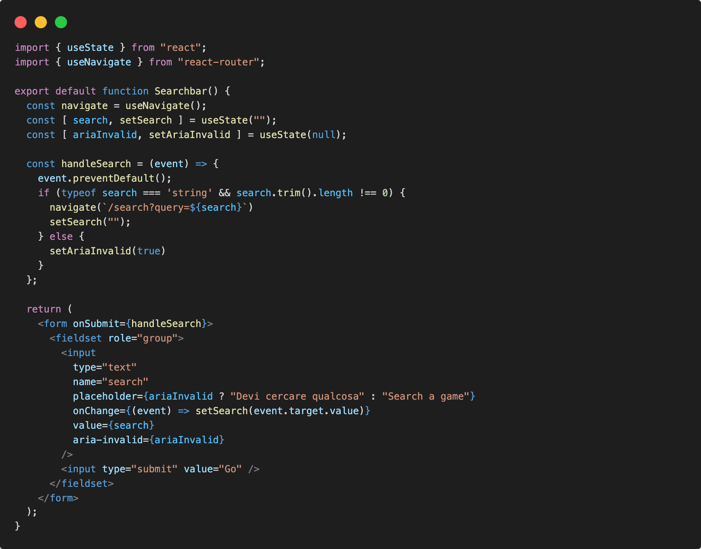
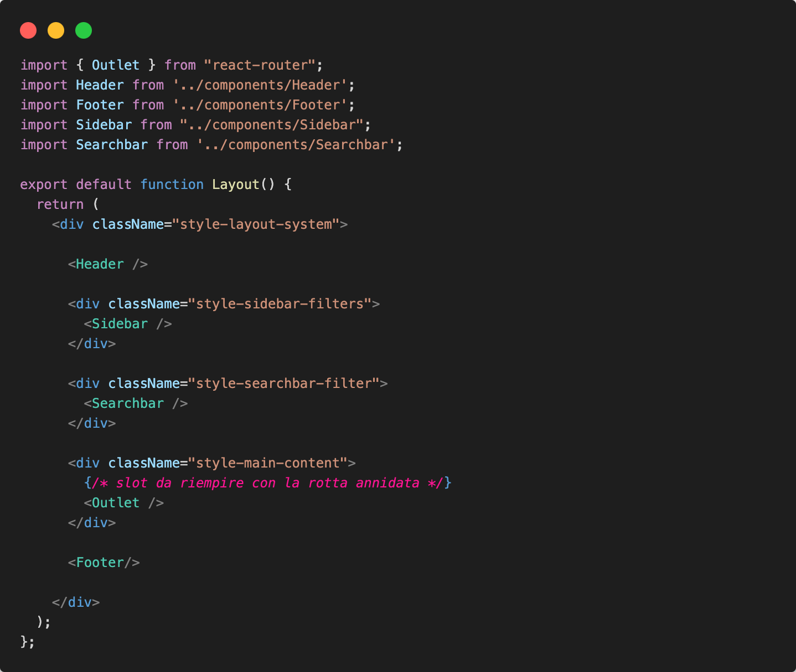
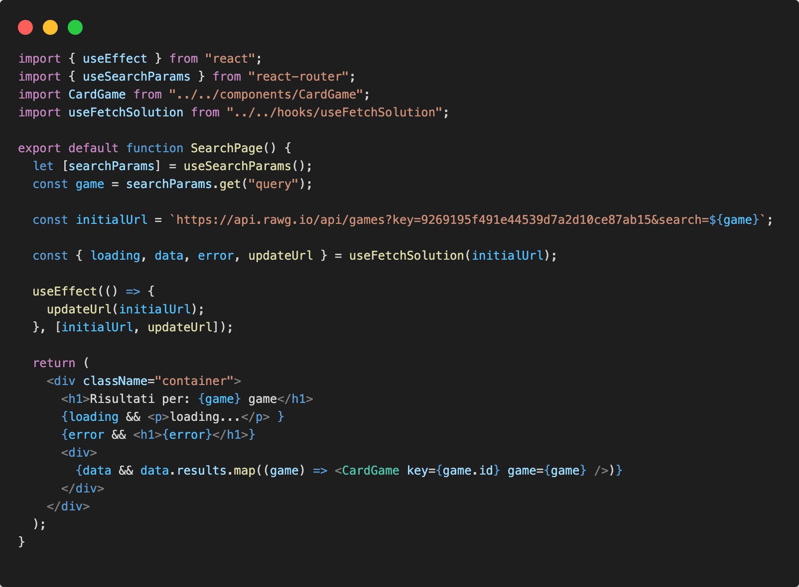

# Query params search

Daremo la possibilitá all'utente di cercare un gioco per nome.
Dopo aver compilato il form di ricerca l'utente verrá ridirezionato nella pagina con i risultati della ricerca.

Cattureremo il risultato della query nella url per poi effetturare sempre la logica della chiamata API nella pagina di risposta.

## Route /search

Andiamo ad aggiungere la rotta /search nel nostro routing system.

```jsx
<Route path="/search" element={<SearchPage />} />
```

il componente da mostrare sarà nella pagina searchpage/index.jsx dove verrá generato il functional component ```<SearchPage />```

```.
└─ src/                   # source dir
    ├─ assets/
    ├─ layout/
    ├─ components/
    ├─ pages/
      └─ homepage/
        └─ index.jsx
      └─ error/
        └─ index.jsx
      └─ genrepage/
        └─ index.jsx
      └─ gamepage/
        └─ index.jsx
      └─ searchpage/
        └─ index.jsx
    ├─ routes/
    ├─ App.jsx
    ├─ global.css
    └─ main.jsx
```

Creeremo la pagina della cartella pages/searchpage/index.jsx:

```jsx
export default function SearchPage() {
  return (
    <>
      Search page
    </>
  )
}
```

Dopo aver creato il componente e averlo esportato ricordiamoci di importarlo nel nostro routing system.

## Form Search UI component

Avremo bisogno di un ```<form></form>``` di ricerca per ridigerci sulla rotta della /search dopo che l'utente inserisce il gioco ricercato.

Costruiremo il componente Searchbar.jsx nella cartella /components, con la gestione dello stato dell'input di ricerca all'evento ```onChange``` e all'evento ```onSubmit``` sottomettiamo il form per ridirigerci alla rotta dinamica attraverso il query string params.

In Searchbar.jsx:



Posizioneremo il componente Searchbar.jsx nel layout generale nel caso volessimo avere la barra di ricerca sempre a disposizione nell'interfaccia utente. ( Elemento a discrezione dello studente )

In Layout.jsx:



## useSearchParams usage

Mostremo i risultati della ricerca dopo la cattura del query string params dalla rotta /search effettuando la fetch al seguente endpoint: ```https://api.rawg.io/api/games?key=9269195f491e44539d7a2d10ce87ab15&search=${game}```

In searchpage/index.jsx mostreremo i risultati:



