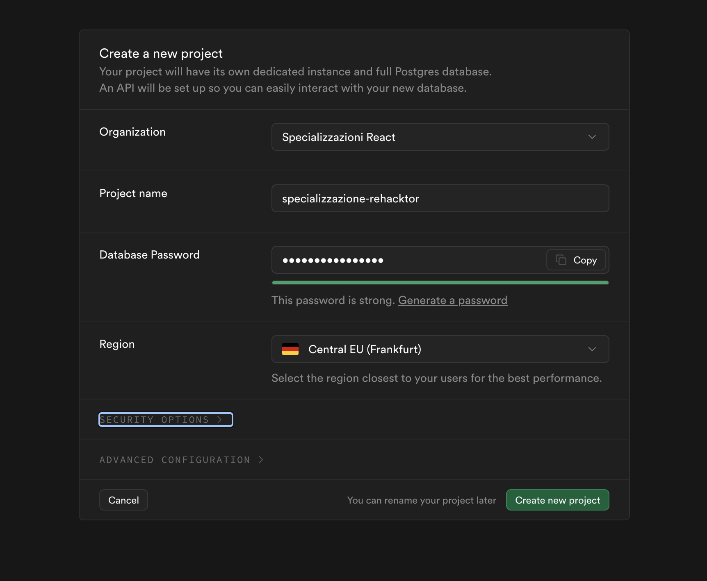
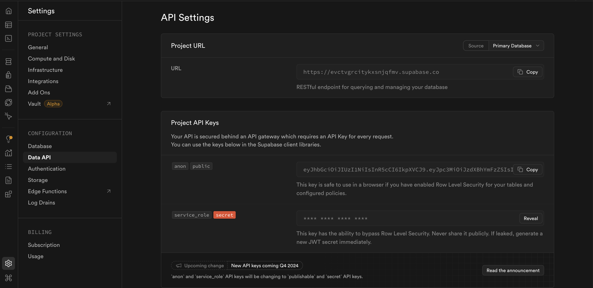
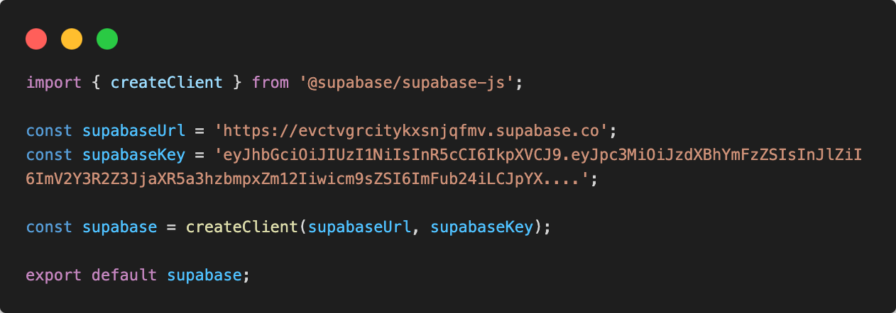
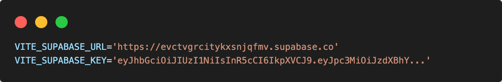
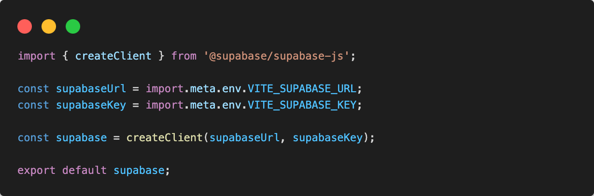

# Supabase

## Backend integration

È arrivato il momento di intergrare il backend mediando l'uso di un Backend as a Service [supabase](https://supabase.com/)

Il primo passaggio sarà registrarsi sulla piattaforma e creare il progetto attraverso l'interfaccia.

## Create supabase project



Dopo aver creato il nuovo progetto avremo bisogno delle chiavi api generate da supabase per poterlo intergrare nel nostro progetto react.

## API keys

Nella sezione project settings/configuration/Data API saranno presenti le configurazioni necessarie

Assicuriamoci di avere abilitata la spunta su ```Enable Data API```

Dopo esserci assicurati l'uso delle api di supabase, avremo bisogno di una ```project url``` e ```project api key``` nel nostro progetto react che possiamo ricavare dallo stesso pannello di configurazione.



## Connect to react project

Tutti i progetti hanno un endpoint RESTful che puoi utilizzare con la chiave API del tuo progetto per interrogare e gestire il tuo database. Questi possono essere ottenuti dalle impostazioni API.

Puoi inizializzare un nuovo client Supabase utilizzando il metodo ```createClient()```.

Il client Supabase è il tuo punto di accesso al resto delle funzionalità di Supabase.

Per ordine creeremo una cartella supabase/ in /src con un file ```supabase-client.js``` in cui verrà inizializzata la connessione con supabase.

```.
└─ src/                   # source dir
    ├─ assets/
    ├─ layout/
    ├─ components/
    ├─ pages/
    ├─ routes/
    ├─ supabase/
      └─ supabase-client.js
    ├─ App.jsx
    ├─ global.css
    └─ main.jsx
```

Scaricheremo la dipendenza supabase per il suo utilizzo nel progetto, dal terminale eseguiamo nella cartella di progetto il comando:

```sh
npm install @supabase/supabase-js
```

In supabase-client.js:



In questo modo dovremmo avere accesso a tutti gli endpoint delle api fornite da supabase all'interno del nostro progetto react.

## Environment variables

Ultimo passaggio da fare per non pushare gli api keys nel repository remoto è quello di creare delle variabili d'ambiente nel file ```.env.local```, assicurandoci di passare il file nel ```.gitingnore```.

Dopo aver creato ```.env.local``` nella root del progetto:

In .env.local:



Dopo pulliamo le variabili in supabase/supabase-client.js:

