# Autenticazione con Supabase

Supabase Auth semplifica l'implementazione dell'autenticazione e dell'autorizzazione nella tua app, offrendo delle API per la gestione degli utenti

Gli steps principali sono:

- Autenticazione: verifica l'identità dell'utente.
- Autorizzazione: controlla quali risorse può accedere l'utente.

Supabase Auth utilizza JSON Web Tokens (JWTs) per l'autenticazione e si integra con le funzionalità del database Supabase, sfruttando ```Row Level Security (RLS)``` per l'autorizzazione.

- Utilizza il database Postgres per memorizzare i dati utente in uno schema dedicato.
- Può essere collegato ad altre tabelle tramite funzioni ```trigger``` e ```foreign key references```  

Supabase Auth inoltre supporta diversi metodi di autenticazione, tra cui:

- Password, Magic Link e altri...

Noi faremo uso solo della password per semplificare le operazioni.

## Email, Password provider

Verificheremo che per i sistemi di autenticazioni sia abilitato il sistema Email e password, nella sezione della dashboard, Authentication/Configuration/Sign In-Up assicuriamoci di avere abilitato Email come Auth provider:

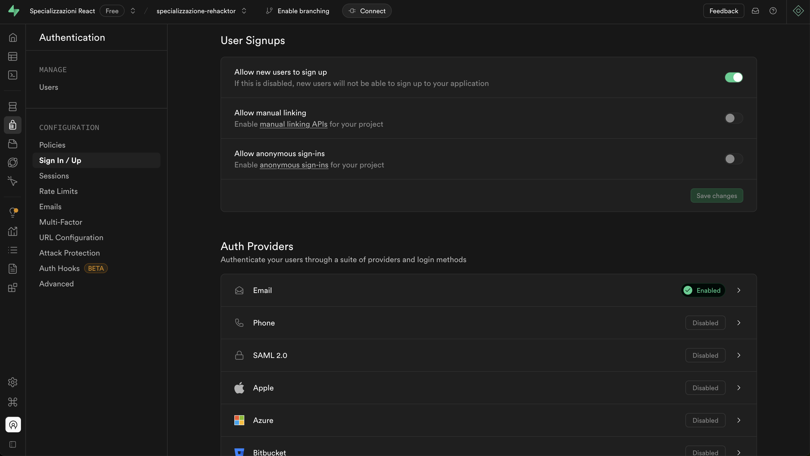

In Email, abilitiamo solo ```Enable Email provider``` e facciamo click su ```save```:

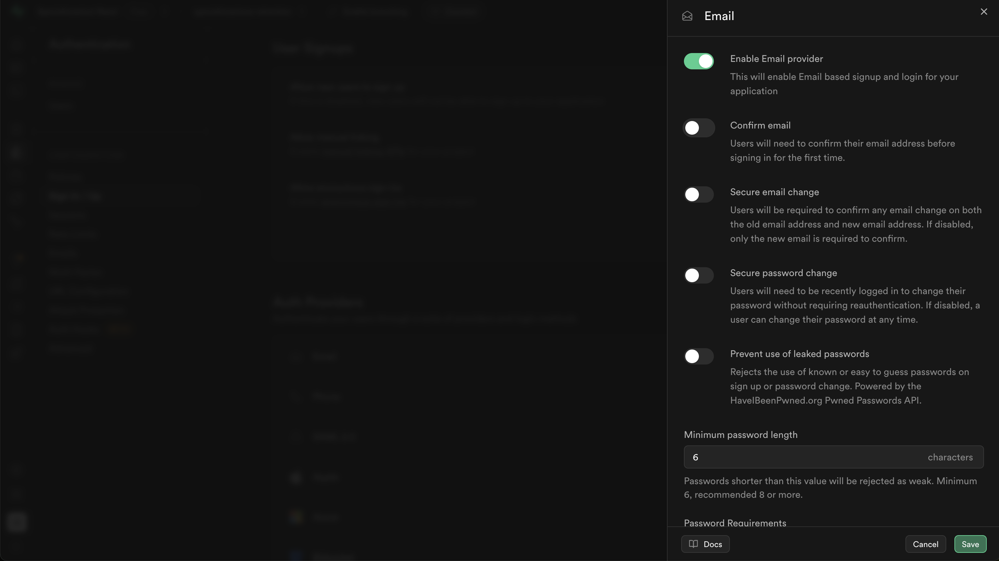

## User Management

Possiamo gestire gli utenti dalla pagina Authentication/Users direttamente dalla dashboard, i dati dell'Auth schema sono visibili nel Table Editor.

Per motivi di sicurezza, lo schema Auth non è esposto nell'API generata automaticamente, per questo supabase autogenera la tabella Users, giá pronta e disponibile durante la creazione del progetto.
Per accedere ai dati di Users o esterdere la tabella utenti con altri campi via API, possiamo creare la nostra tabella ```profiles``` che estenderá di informazioni la tabella Users nel public schema.

Assicuriamoci di proteggere sempre la tabella associata agli utenti abilitando ```Row Level Security (RLS)``` e facendo riferimento alla tabella ```auth.users``` per garantire l'integrità dei dati.
Useremo ```on delete cascade``` per mantenere le relazioni coerenti, ad esempio con una tabella ```public.profiles```.

Per ottenere tutto questo dovremmo passare uno script direttamente nella dashboard nella pagina SQL Editor con le seguenti direttive:

```sql
-- Create a table for public profiles
create table profiles (
  id uuid references auth.users on delete cascade not null primary key,
  updated_at timestamp with time zone,
  username text unique,
  first_name text,
  last_name text,
  avatar_url text,

  constraint username_length check (char_length(username) >= 3)
);

-- Set up Row Level Security (RLS)
-- See https://supabase.com/docs/guides/auth/row-level-security for more details.
alter table profiles
  enable row level security;

create policy "Public profiles are viewable by everyone." on profiles
  for select using (true);

create policy "Users can insert their own profile." on profiles
  for insert with check (auth.uid() = id);

create policy "Users can update own profile." on profiles
  for update using (auth.uid() = id);

-- This trigger automatically creates a profile entry when a new user signs up via Supabase Auth.
-- See https://supabase.com/docs/guides/auth/managing-user-data#using-triggers for more details.
create function public.handle_new_user()
returns trigger as $$
begin
  insert into public.profiles (id, username, first_name, last_name, avatar_url)
  values (new.id, new.raw_user_meta_data->>'username', new.raw_user_meta_data->>'first_name', new.raw_user_meta_data->>'last_name', new.raw_user_meta_data->>'avatar_url');
  return new;
end;
$$ language plpgsql security definer;
create trigger on_auth_user_created
  after insert on auth.users
  for each row execute procedure public.handle_new_user();

-- Set up Storage!
insert into storage.buckets (id, name)
  values ('avatars', 'avatars');

-- Set up access controls for storage.
-- See https://supabase.com/docs/guides/storage#policy-examples for more details.
create policy "Avatar images are publicly accessible." on storage.objects
  for select using (bucket_id = 'avatars');

create policy "Anyone can upload an avatar." on storage.objects
  for insert with check (bucket_id = 'avatars');

```

Lo Script eseguirá il codice SQL generando per noi:

- Tabella```public.profiles``` con campi: id, updated_at, username, first_name, last_name, avatar_url
- Una funzione ```handle_new_user()``` per l'inserimento dei dati nella tabella ```public.profiles``` e una funzione trigger che aggiornerá la tabella ogni volta che un utente viene registrato.
- Delle Row Level Security (RLS) per l'accesibiltá alla tabella ```public.profiles```
- Il setup di uno storage ```Avatars``` per l'inserimento degli assets statici.
- Delle Row Level Security (RLS) per l'accesibiltá dello storage ```Avatars```

Dopo aver copiato lo snippet SQL e incollato nella SQL editor, eseguiamo il codice cliccando su ```run```

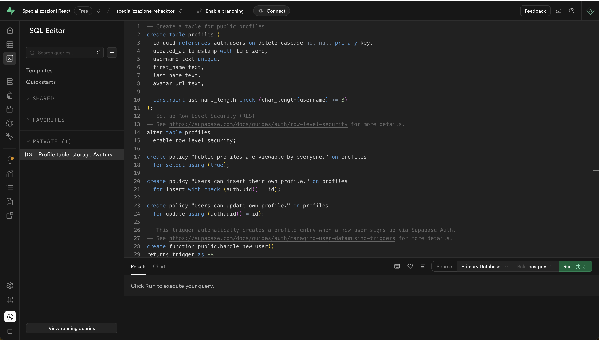

Dovrebbe restituire ```Success. No rows returned```

Nella sezione della dashboard Database/Tables dovrebbe esserci la nostra tabella ```profiles``` e nella sezione Storage/All bucket dovrebbe esserci il nostro storage ```avatars```

## Register users

Dopo aver configurato il nostro database, possiamo adesso registrare, aggiungere utenti attraverso le API messe a disposizione da supabase dal nostro progetto React.

### Signing up with an email and password

Supabase semplifica la gestione degli utenti in fase di registrazione assegnando a ciascun utente un ID univoco. Possiamo fare riferimento a questo ID ovunque nel tuo database, inoltre include già le funzioni integrate per la registrazione, l'accesso e il logout.

La funzione ```signUp``` permette agli utenti la registrazione e la creazione di un nuovo account, una volta registrato l'utente potrá affettuare l'accesso mediante quello specifico account, ad esempio:

```js
let { data, error } = await supabase.auth.signUp({
  email: 'someone@email.com',
  password: 'HtrcfzJIXTcyJAuctARY'
})
```

### SignUp Form

Come primo step, nel nostro progetto creamo un from per la registrazione degli utenti. Avremo una pagina dedicata alla registrazione. Quindi ci occuperemo di creare la pagina register in /pages e la rotta nel routing.jsx.

```.
└─ src/                   # source dir
    ├─ assets/
    ├─ layout/
    ├─ components/
    ├─ pages/
      └─ homepage/
        └─ index.jsx
      └─ error/
        └─ index.jsx
      └─ genrepage/
        └─ index.jsx
      └─ gamepage/
        └─ index.jsx
      └─ searchpage/
        └─ index.jsx
      └─ register/
        └─ index.jsx
    ├─ routes/
    ├─ App.jsx
    ├─ global.css
    └─ main.jsx
```

In routing.jsx aggiungiamo la rotta ricordandoci di importare il componente:

```js
<Route path="/register" element={<RegisterPage />}/>
```

Aggiungiamo al componente Header.jsx un bottone o link per accedere alla pagina /register

In Header.jsx:

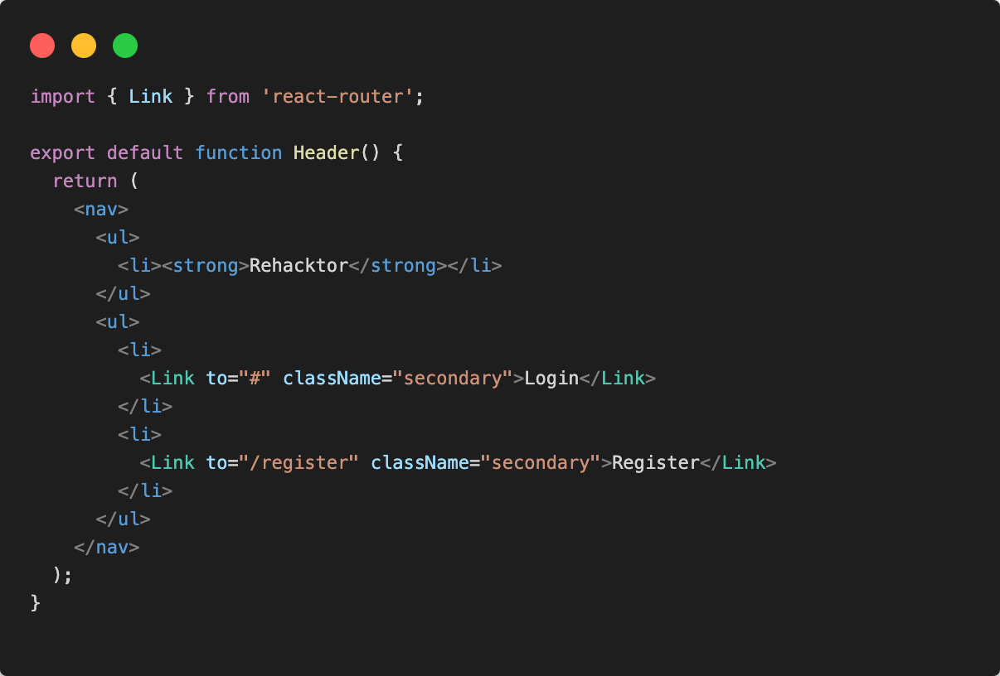

## Validation state form management

Nella pagina register/index.jsx definiamo il markup del componente RegisterPage.jsx.
Il componente RegisterPage presenterá un form con i campi:

- Email
- firstName
- LastName
- Username
- Password

Ogni campo avrá implementato un sistema di validazione mediante la schema validation library ```zod```

Installiamo zod nella cartella di progetto

```sh
npm install zod
```

Creamo una cartella /lib nella src del progetto con un file ```validationForm.js``` con delle funzioni di utilitá per la validazione dei campi del form

In validationForm.js

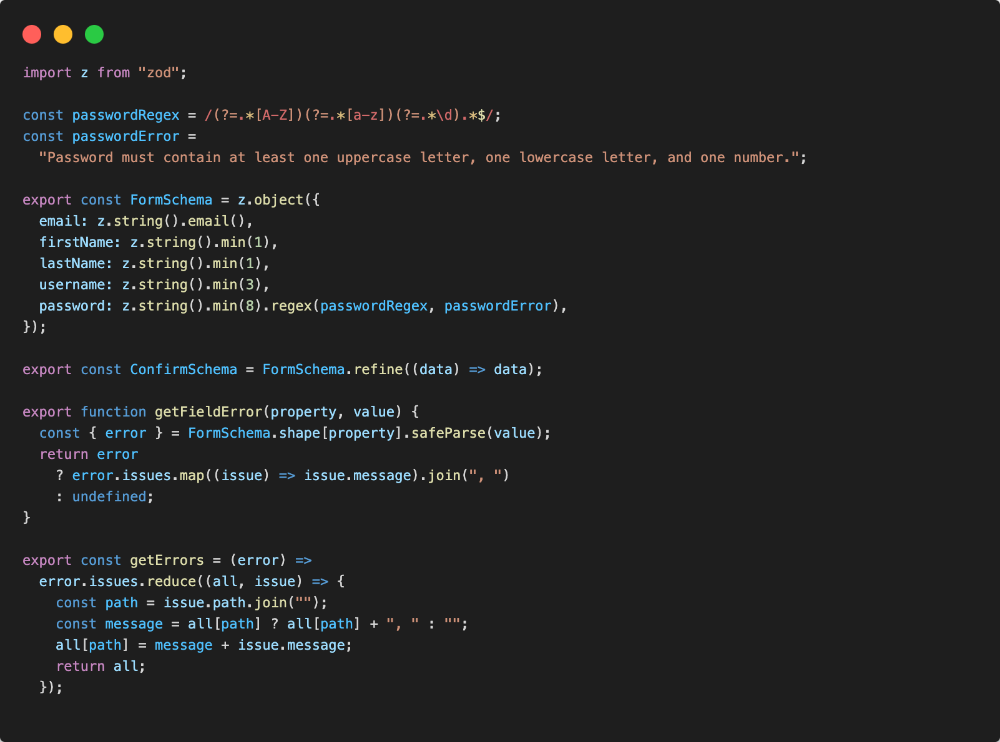

Dopo aver esportato le funzioni di intercettazione degli errori di validazione definite nello schema validator ```FormSchema```, le andremo ad utilizzare agli ```onChange``` e ```onSubmit``` del nostro form di registrazione.

In RegisterPage.jsx:

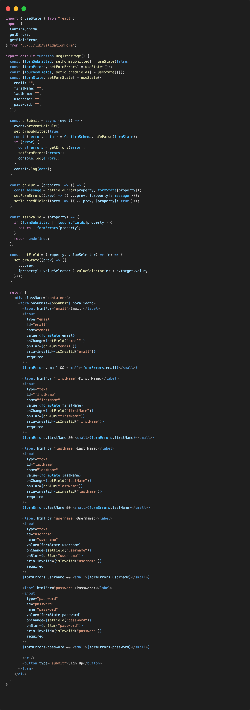

Dopo aver superato la nostra validazione con zod lato client... Il codice precedente stampa semplicemente in console il formState. Quello che faremo sarà estrapolare dal formState i campi necessari per chiamare la funzione supabase ```auth.signUp``` al ```onSubmit``` del form.

Nella funzione ```onSubmit``` andreamo a modificare per usare l'API di supabase:

```jsx
const onSubmit = async (event) => {
    event.preventDefault();
    setFormSubmitted(true);
    const { error, data } = ConfirmSchema.safeParse(formState);
    if (error) {
      const errors = getErrors(error);
      setFormErrors(errors);
      console.log(errors);
    } else {
      let { error } = await supabase.auth.signUp({
        email: data.email,
        password: data.password,
        options: {
          data: {
            first_name: data.firstName,
            last_name: data.lastName,
            username: data.username
          }
        }
      });
      if (error) {
        alert("Signing up error 👎🏻!");
      } else {
        alert("Signed up 👍🏻!");
        await new Promise((resolve) => setTimeout(resolve, 1000));
        navigate("/");
      }
    }
  };
```

Controlliamo adesso nella dashboard se effettivamente é stato correttamemte inserito e registrato il nuovo utente

In Authentication/Users 🎉

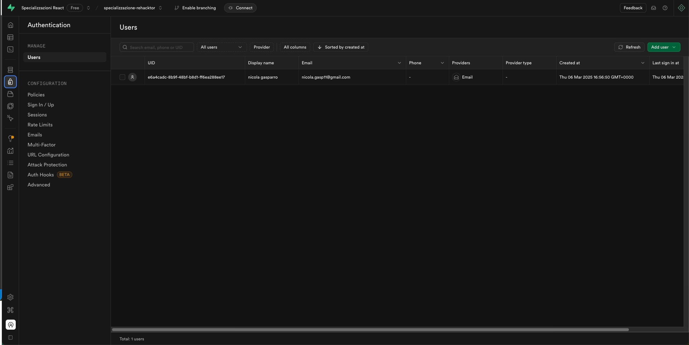

In Table Editor/profile table 🎉

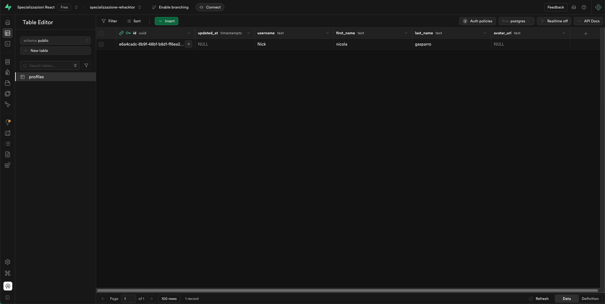

Da notare che:

```js
await new Promise((resolve) => setTimeout(resolve, 1000));
navigate("/");
```

usati nella funzione ```onSubmit``` del form di registrazione, non fanno altro che generare un piccolo delay di 1 secondo e ridirigerci alla pagina homepage.

## Retrive session and logout

Adesso andreamo nel layout e nello specifico in ```Header``` component a otterene i dati e la sessione dell'utente attualmente autenticato dopo la registrazione, per mostrare un bottone di logout in caso di una sessione attiva aperta.

Useremo le API di supabase per accedere a queste informazioni, su [Auth-api](https://supabase.com/docs/reference/javascript/auth-api) è possibile vedere tutte le API a disposizione per l'autenticazione

In Header.jsx:

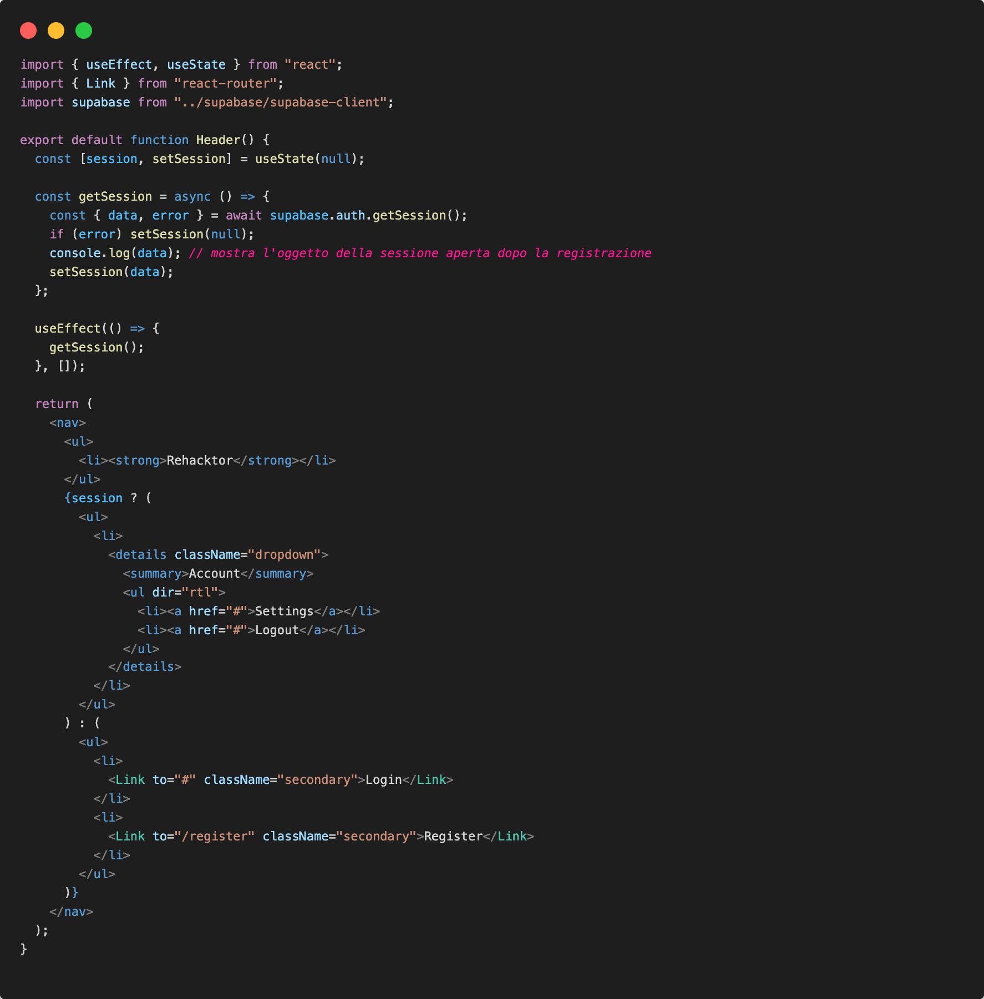

L'oggetto della sessione attiva dovrebbe risultare cosi:

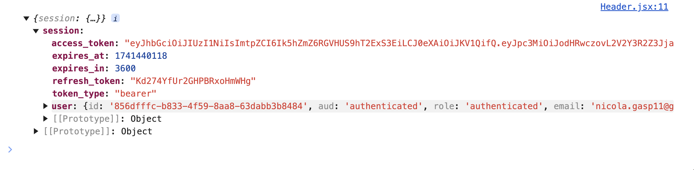

### Logout

Attraverso il conditional rendering mostriamo un bottone per consentire all'utente anche di fare logout dalla piattaforma.

Implementiamo la funzione API logout di supabase al ```onClick``` del bottone logout.

In Header.jsx:

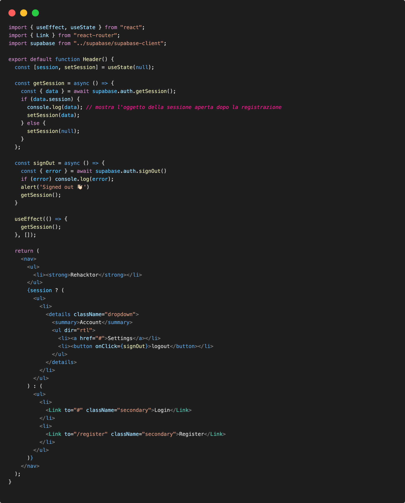

## Login users

### Signing in with an email and password

La funzione signInWithPassword permette agli utenti dopo la registrazione l'accesso mediante quello specifico account, ad esempio:

```js
const { data, error } = await supabase.auth.signInWithPassword({
  email: 'example@email.com',
  password: 'example-password',
})

```

### SignIn Form

Come primo step, nel nostro progetto creamo un from per il login degli utenti. Avremo una pagina dedicata al login. Quindi ci occuperemo di creare la pagina login in /pages e la rotta nel routing.jsx.

```.
└─ src/                   # source dir
    ├─ assets/
    ├─ layout/
    ├─ components/
    ├─ pages/
      └─ homepage/
        └─ index.jsx
      └─ error/
        └─ index.jsx
      └─ genrepage/
        └─ index.jsx
      └─ gamepage/
        └─ index.jsx
      └─ searchpage/
        └─ index.jsx
      └─ register/
        └─ index.jsx
      └─ login/
        └─ index.jsx
    ├─ routes/
    ├─ App.jsx
    ├─ global.css
    └─ main.jsx
```

In routing.jsx aggiungiamo la rotta ricordandoci di importare il componente:

```js
<Route path="/login" element={<LoginPage />}/>
```

Aggiungiamo al componente Header.jsx un bottone o link per accedere alla pagina /login

In Header.jsx modifichiamo:

```jsx
<li>
  <Link to="/login" className="secondary">Login</Link>
</li>
```

In login/index.jsx, implementiamo lo stesso codice di register per la validazione del login form.
Il componente LoginPage presenterá un form con i campi:

- Email
- Password

Dopo aver superato la nostra validazione con zod lato client... Quello che faremo sarà estrapolare dal formState i campi necessari per chiamare la funzione supabase auth.signInWithPassword al onSubmit del form come abbiamo fatto per la registazione.

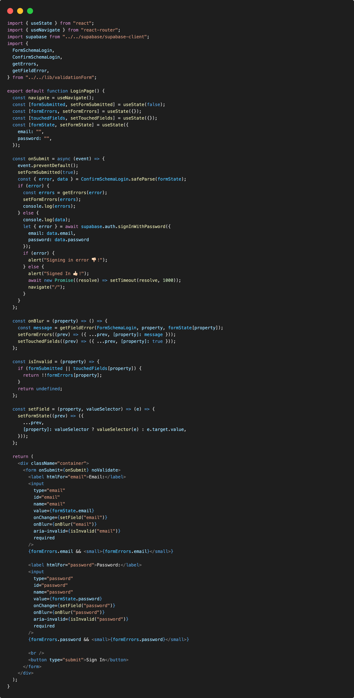

Il nostro flusso di *autenticazione* utente è completato, l'utente sarà in grado di registrarsi, accedere tramite login e fare logout dalla piattaforma.
