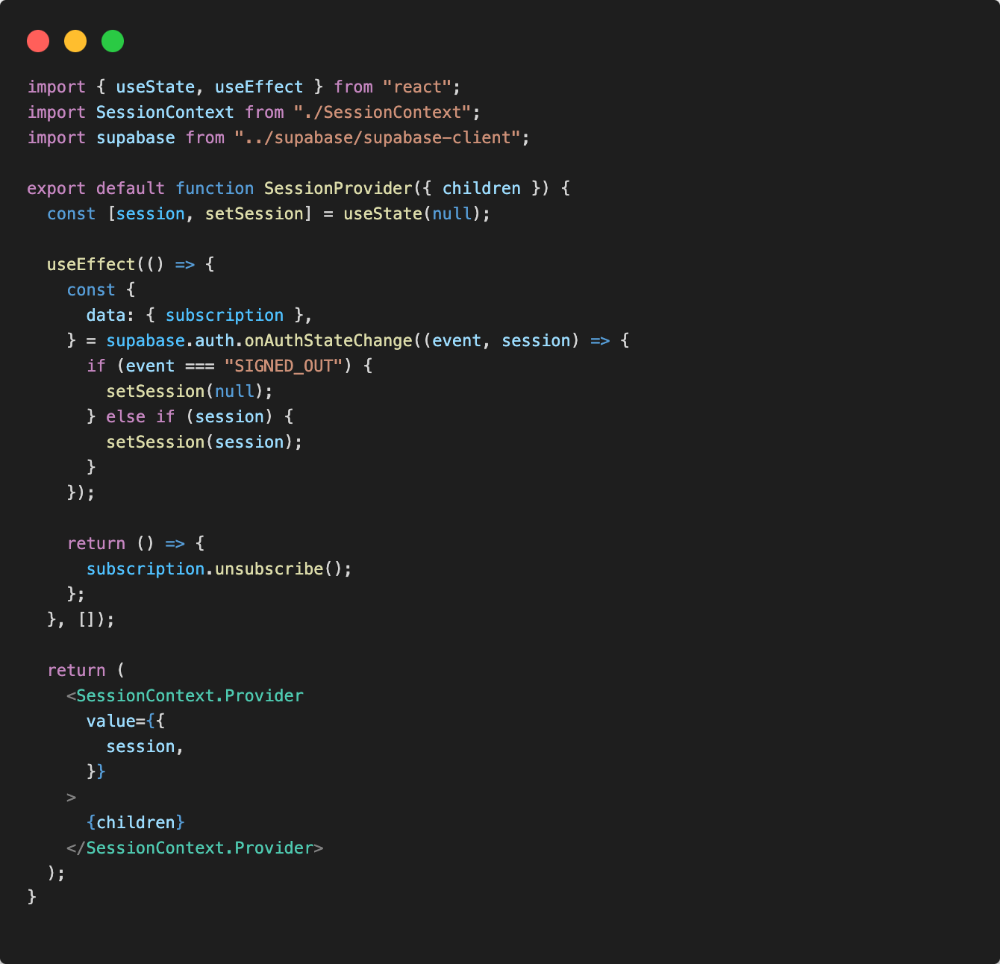
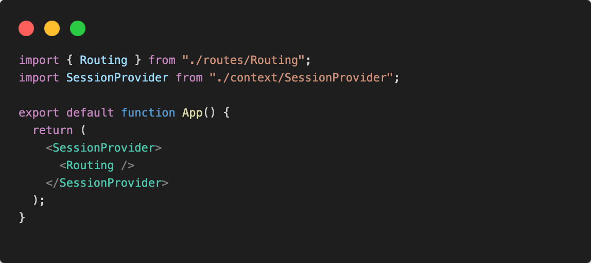
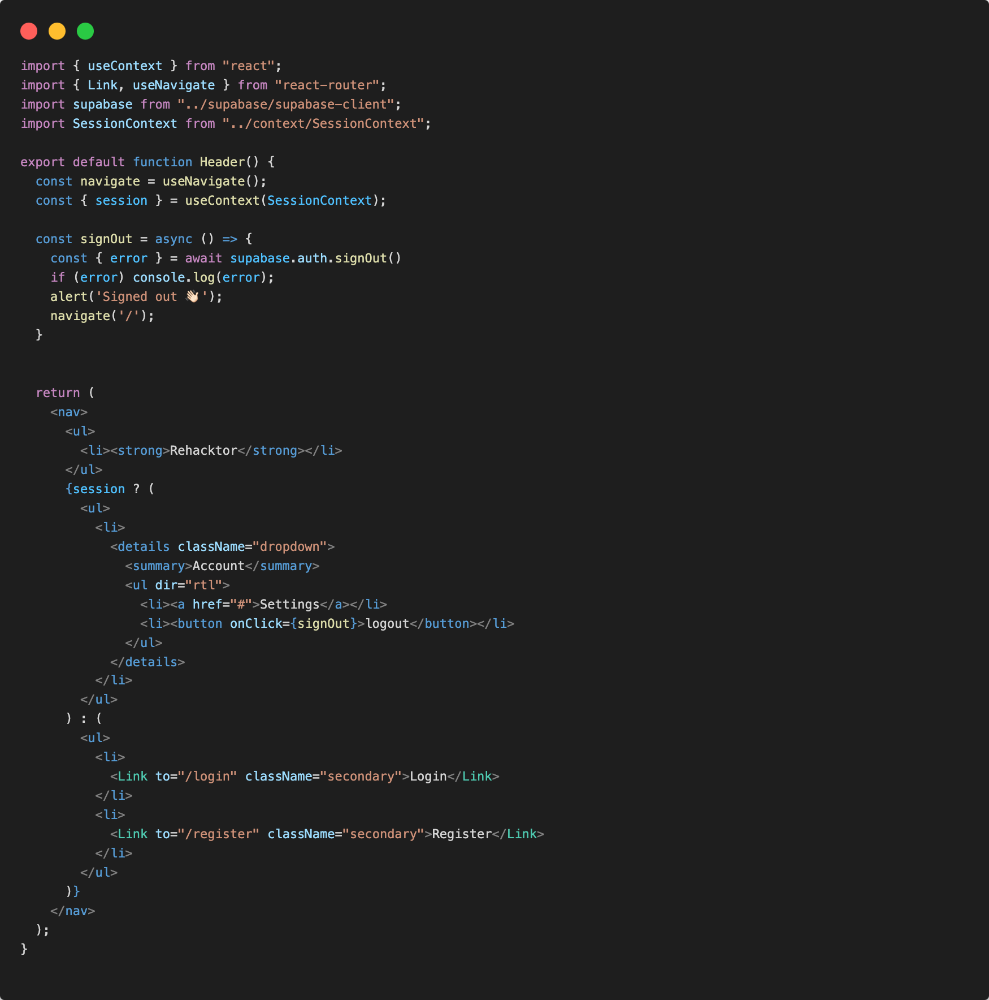

# SessionProvider

Per non catturare la sessione attiva esclusivamente in un componente andremo a creare un contesto, mediante l'uso del Context API di react, in modo da poter gestire globalmente lo stato della sessione attiva, e poterlo eventualmente usare in vari componenti.

## Create Context

Primo passaggio sarà quello di creare un cartella /context al cui interno creeremo un SessionContext.js e SessionProvider.jsx

```.
└─ src/                   # source dir
    ├─ assets/
    ├─ layout/
    ├─ context/
      ├─ SessionContext.js
      └─ SessionProvider.jsx
    ├─ components/
    ├─ pages/
    ├─ routes/
    ├─ App.jsx
    ├─ global.css
    └─ main.jsx
```

in SessionContext.js andiamo a generare il context mediante ```createContext```:

```js
import { createContext } from "react";

const SessionContext = createContext(null);

export default SessionContext;
```

## Create SessionProvider

In SessionProvider.jsx andremo a creare un provider che gestirà lo stato session globalmente:



Il compito del nostro provider sarà quello di essere sempre in ascolto dei cambiamenti dello stato della sessione e condividere questo stato tra tutti i componenti attraverso il context.

Ora tutte le nostre pagine dovranno poter accedere alla sessione del provider

In App.jsx:



Ora che le informazioni e la sessione sono disponibili globalmemte con il SessionProvider, potranno essere usare con ```useContext``` di react.

## Context Usage

Faremo refactoring e modificheremo l'uso locale dello stato session in Header.jsx e faremo questa volta uso del context.

In Header.jsx:



Saremo pronti d'ora in avanti a usare il dato session globalmente dal context senza essere costretti a ridefinire uno stato session per ogni componente che lo utilizzerà.
