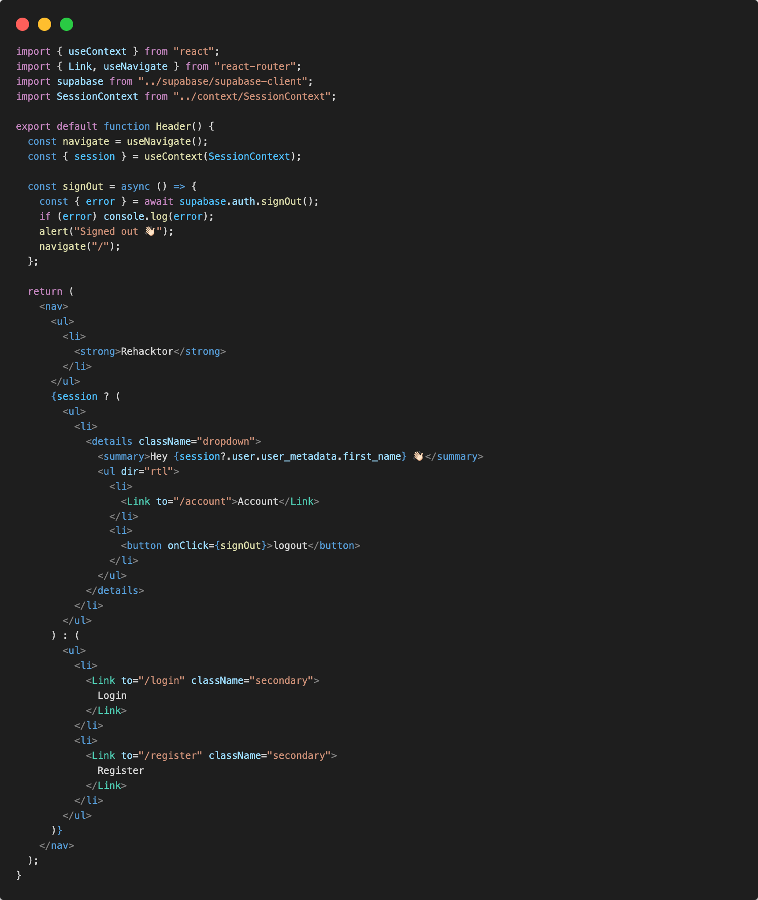
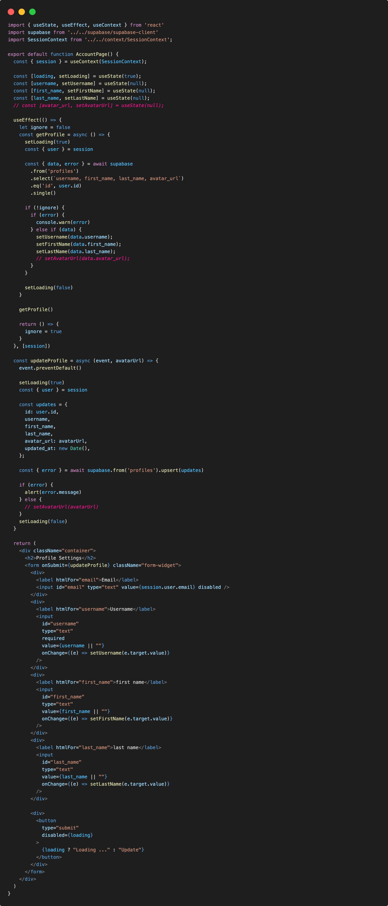
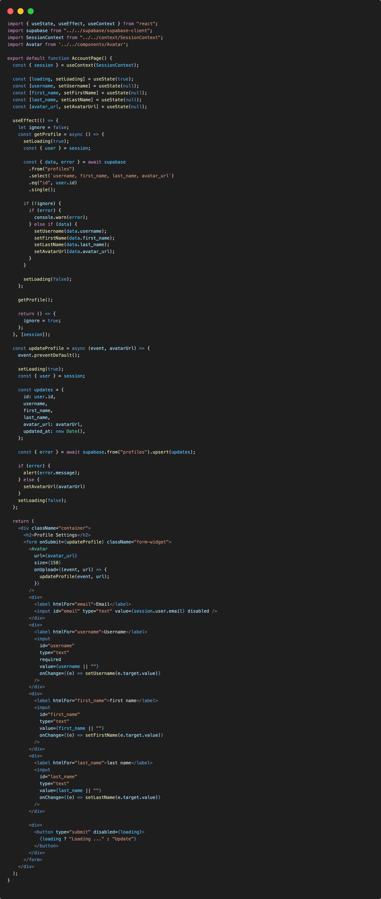
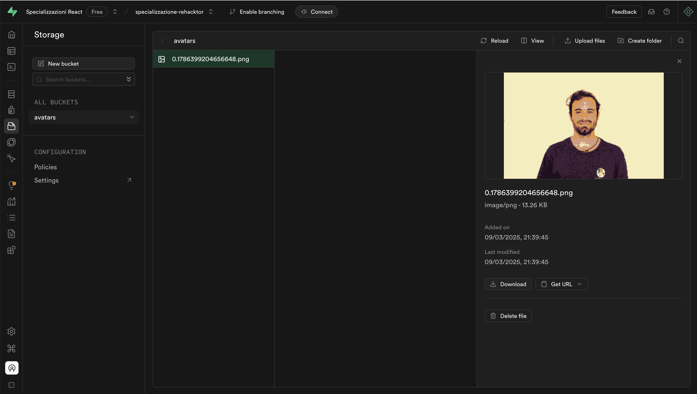

# Account page

Dopo essersi autenticato, permetteremo all'utente di modificare le informazioni riguardanti il suo profilo cosi da poter gestire il proprio account.

Per farlo creeremo una pagina in /pages con una nuova cartella account/index.jsx al cui interno creeremo il componente ```AccountPage.jsx```

```.
└─ src/                   # source dir
    ├─ assets/
    ├─ layout/
    ├─ components/
    ├─ pages/
      └─ homepage/
        └─ index.jsx
      └─ error/
        └─ index.jsx
      └─ genrepage/
        └─ index.jsx
      └─ gamepage/
        └─ index.jsx
      └─ searchpage/
        └─ index.jsx
      └─ register/
        └─ index.jsx
      └─ account/
        └─ index.jsx
    ├─ routes/
    ├─ App.jsx
    ├─ global.css
    └─ main.jsx
```

In routing.jsx aggiungiamo la rotta ricordandoci di importare il componente:

```js
<Route path="/account" element={<AccountPage />}/>
```

Aggiungiamo al componente Header.jsx un bottone o link per accedere alla pagina /account una volta autenticati

In Header.jsx:



Nel componente ```AccountPage```:



## Create an upload widget

Andiamo a creare un avatar per l'utente in modo che possa caricare una immagine profilo. Per fare questo creeremo un nuovo componente:

Creamo e modifichiamo ```components/Avatar.jsx```:

```jsx
import { useEffect, useState } from 'react'
import supabase from '../supabase/supabase-client'

export default function Avatar({ url, size, onUpload }) {
  const [avatarUrl, setAvatarUrl] = useState(null)
  const [uploading, setUploading] = useState(false)

  useEffect(() => {
    if (url) downloadImage(url)
  }, [url])

  const downloadImage = async (path) => {
    try {
      const { data, error } = await supabase.storage.from('avatars').download(path)
      if (error) {
        throw error
      }
      const url = URL.createObjectURL(data)
      setAvatarUrl(url)
    } catch (error) {
      console.log('Error downloading image: ', error.message)
    }
  }

  const uploadAvatar = async (event) => {
    try {
      setUploading(true)

      if (!event.target.files || event.target.files.length === 0) {
        throw new Error('You must select an image to upload.')
      }

      const file = event.target.files[0]
      const fileExt = file.name.split('.').pop()
      const fileName = `${Math.random()}.${fileExt}`
      const filePath = `${fileName}`

      const { error: uploadError } = await supabase.storage.from('avatars').upload(filePath, file)

      if (uploadError) {
        throw uploadError
      }

      onUpload(event, filePath)
    } catch (error) {
      alert(error.message)
    } finally {
      setUploading(false)
    }
  }

  return (
    <div>
      {avatarUrl ? (
        
      ) : (
        <div className="avatar no-image" style={{ height: size, width: size }} />
      )}
      <div style={{ width: size }}>
        <input
          type="file"
          id="single"
          accept="image/*"
          onChange={uploadAvatar}
          disabled={uploading}
        />
      </div>
    </div>
  )
}
```

## Add the new widget

Adesso possiamo aggiungere il widget alla pagina account/index.jsx al componente ```AccountPage```:



Controlliamo nella nostra dashboard se nello storage abbiamo caricato il nostro asset, in ```Storage/buckets/avatars```:



A questo punto abbiamo una pagina aggiornamento profilo utente con avatar storage image integrato!

