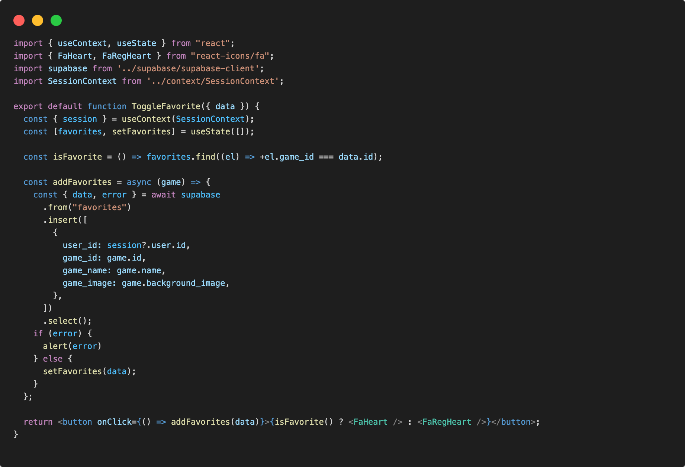
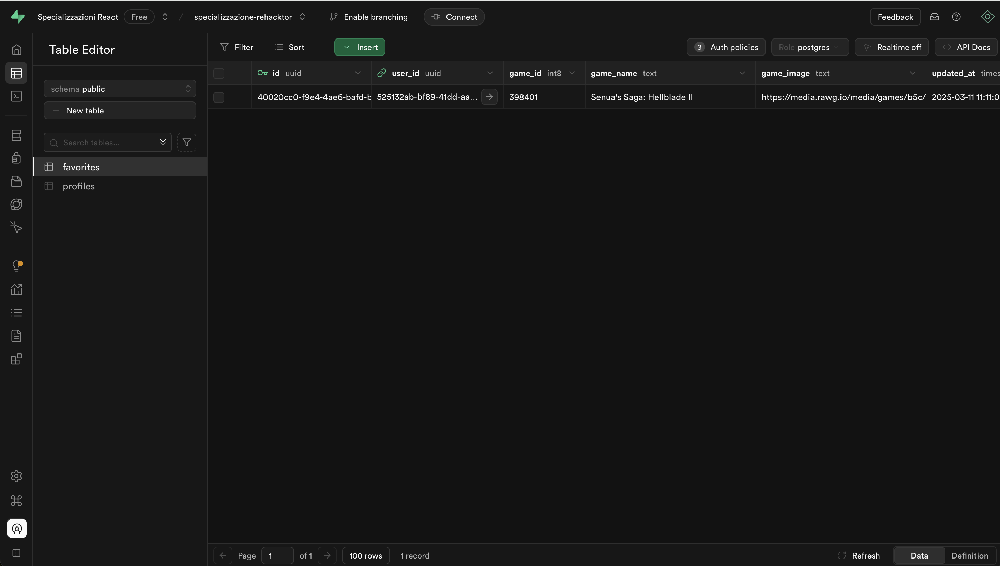
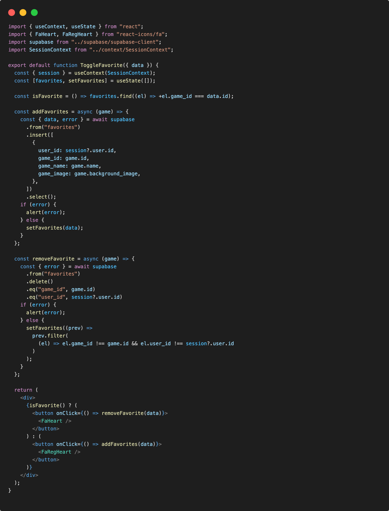
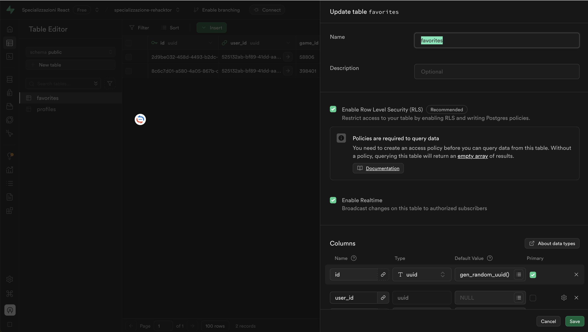
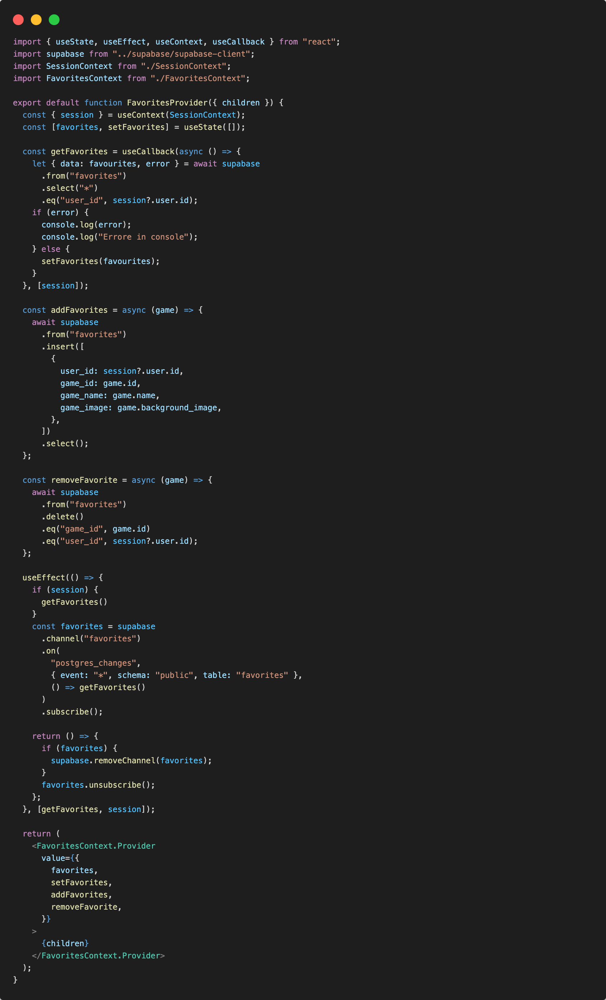
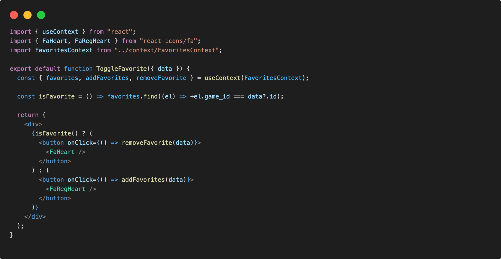
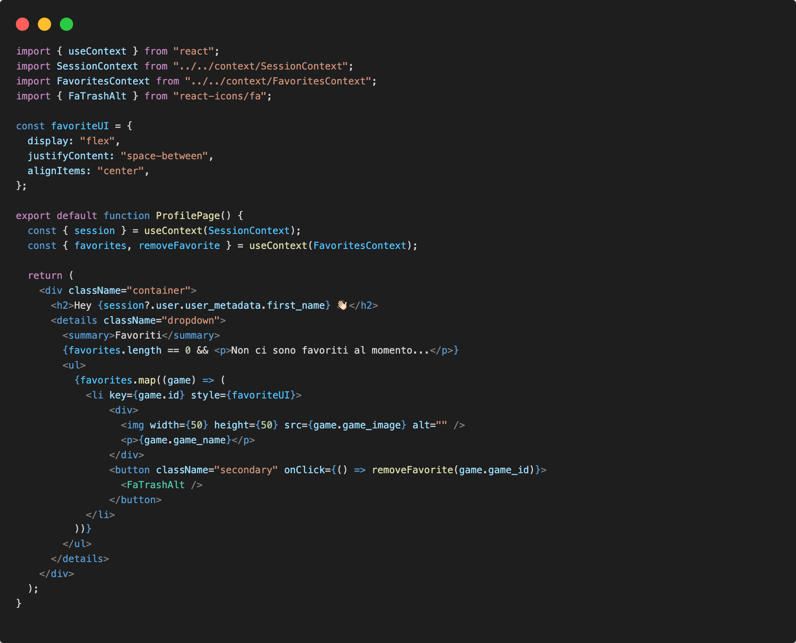

# Favorites List

Da questo momento consetiremo agli utenti autenticati la creazione e la gestione di una lista giochi preferiti dalla piattaforma.

## Table public.favorites

Come primo passo avremo bisogno di una tabella nel database per salvare la lista creata dall'utente.

Avremo bisogno di generere la tabella ```public.favorites``` come abbiamo già fatto con ```public.profiles```.

Assicuriamoci di proteggere sempre la tabella associata agli utenti abilitando Row Level Security (RLS) e facendo riferimento alla tabella auth.users per garantire l'integrità dei dati. Useremo on delete cascade per mantenere le relazioni coerenti.

Per ottenere tutto questo dovremmo passare uno script direttamente nella dashboard nella pagina SQL Editor con le seguenti direttive:

```sql
-- Create a table for public favorites
create table public.favorites (
  id uuid not null default gen_random_uuid () primary key,
  user_id uuid references auth.users on delete cascade not null,
  game_id bigint null,
  game_name text null,
  game_image text null,
  updated_at timestamp with time zone
);
-- Set up Row Level Security (RLS)
-- See https://supabase.com/docs/guides/auth/row-level-security for more details.
alter table favorites
  enable row level security;

create policy "Public favorites are viewable by everyone." on favorites
  for select using (true);

create policy "Users can insert their own favorites items." on favorites
  for insert with check (auth.uid() = user_id);

create policy "Users can delete their own favorites itemes." on favorites
  for delete using (auth.uid() = user_id);
```

## Insert in Favorites

Una volta generata la tabella in supabase, andiamo sulla pagina del dettaglio del singolo gioco e tramite un elememto UI a discrezione dello studente ( un bottone, un'icona, altro... ) andremo ad aggiungere il gioco alla nostra lista favoriti.

Useremo l'API di supabase per l'inserimento del record nella tabella ```public.favorites```:

```js
const { data, error } = await supabase
  .from('favorites')
  .insert([
    { some_column: 'someValue', other_column: 'otherValue' },
  ])
  .select()
```

Nel pagina gamepage/index.jsx, nel componente ```GamePage``` creeremo un componente UI toggle chiamato ```ToggleFavorite.jsx``` come elemento per l'inserimento del gioco favorito nella lista.

In ToggleFavorite.jsx:



Dopo aver cliccato sul bottone icona, verifichiamo nel database se è presente il dato nella tabella favorites 🎉:



## Remove from Favorites

Allo stesso modo useremo le API di supabase per rimuovere il record dalla tabella ```public.favorites```:

```js
const { error } = await supabase
  .from('favorites')
  .delete()
  .eq('some_column', 'someValue')

```

In ToggleFavorite.jsx:



## FavoritesProvider

Per non usare lo stato ```favorites``` esclusivamente in un componente ```ToggleFavorites``` andremo a creare un contesto, mediante l'uso del Context API di react, in modo da poter gestire globalmente lo stato dei giochi favoriti, e poterlo eventualmente usare in vari componenti.

### Create Context

Primo passaggio sarà quello di creare un cartella /context al cui interno creeremo un FavoritesContext.js e FavoritesProvider.jsx

```.
└─ src/                   # source dir
    ├─ assets/
    ├─ layout/
    ├─ context/
      ├─ SessionContext.js
      ├─ SessionProvider.jsx
      ├─ FavoritesContext.js
      └─ FavoritesProvider.jsx
    ├─ components/
    ├─ pages/
    ├─ routes/
    ├─ App.jsx
    ├─ global.css
    └─ main.jsx
```

in FavoritesContext.js andiamo a generare il context mediante ```createContext```:

```js
import { createContext } from "react";

const FavoritesContext = createContext(null);

export default FavoritesContext;
```

## Create FavoritesProvider

In FavoritesProvider.jsx andremo a creare un provider che gestirà lo stato dei favoriti globalmente e inseriremo tutte le funzioni di lettura dal database, inserimento e eliminazione.

### getFavorites function

Definita in un ```useCallBack``` per non ridefinire la funzione ad ogni re-render:

```js
const getFavorites = useCallback(async () => {
    let { data: favourites, error } = await supabase
      .from("favorites")
      .select("*")
      .eq("user_id", session?.user.id);
    if (error) {
      console.log(error);
      console.log("Errore in console");
    } else {
      setFavorites(favourites);
    }
  }, [session]);
```

### addFavorites function 

```js
const addFavorites = async (game) => {
    await supabase
      .from("favorites")
      .insert([
        {
          user_id: session?.user.id,
          game_id: game.id,
          game_name: game.name,
          game_image: game.background_image,
        },
      ])
      .select();
  };
```

### removeFavorites function

```js
const removeFavorite = async (game) => {
    await supabase
      .from("favorites")
      .delete()
      .eq("game_id", game.id)
      .eq("user_id", session?.user.id);
  };
```

### Listen to favorites table changes

Useremo la funzionalità supabase api ```realtime``` per essere in ascolto degli aggiornamenti ed eventi sulla tabella favorites.

Prima abilitiamo la funzionalitá realtime dalla nostra dashboard. Possiamo direttamente modificare la tabella ```favorites```, spuntando su ```Enable Realtime```



Questa funzionalitá abilitata ci consentirà di essere in constante ascolto degli aggiornamenti dopo le funzioni di ```addFavorites``` e ```removeFavorites```

```js
useEffect(() => {
    if (session) {
      getFavorites()
    }
    const favorites = supabase
      .channel("favorites")
      .on(
        "postgres_changes",
        { event: "*", schema: "public", table: "favorites" },
        () => getFavorites()
      )
      .subscribe();

    return () => {
      if (favorites) {
        supabase.removeChannel(favorites);
      }
      favorites.unsubscribe();
    };
  }, [getFavorites, session]);
```

Tutte queste funzionalità verranno messe a disposizione globalmente grazie al contesto e al provider

In FavoritesProvider.jsx:



### Wrapping FavoritesProvider

Renderemo disponibile il provider a tutta l'applicazione

In App.jsx:

```jsx
import { Routing } from "./routes/Routing";
import SessionProvider from "./context/SessionProvider";
import FavoritesProvider from './context/FavoritesProvider';

export default function App() {
  return (
    <SessionProvider>
      <FavoritesProvider>
        <Routing />
      </FavoritesProvider>
    </SessionProvider>
  );
}
```

## FavoritesContext usage

Come ultimo passaggio potremmo modificare ```ToggleFavorite.jsx``` usando finalmente il contesto globale.

In ToggleFavorite.jsx:



## Managing Favorites List

Adessso che abbiamo i favoriti condivisi in modo globale dal contesto, possiamo gestire questi ultimi anche dalla pagina profilo utente.

Nella pagina profile/index.jsx al componente ```ProfilePage``` inseriremo la lista dei favoriti:



Abbiamo cosi accesso hai giochi favoriti e potró interagire con questi ultimi anche dalla pagina profile.