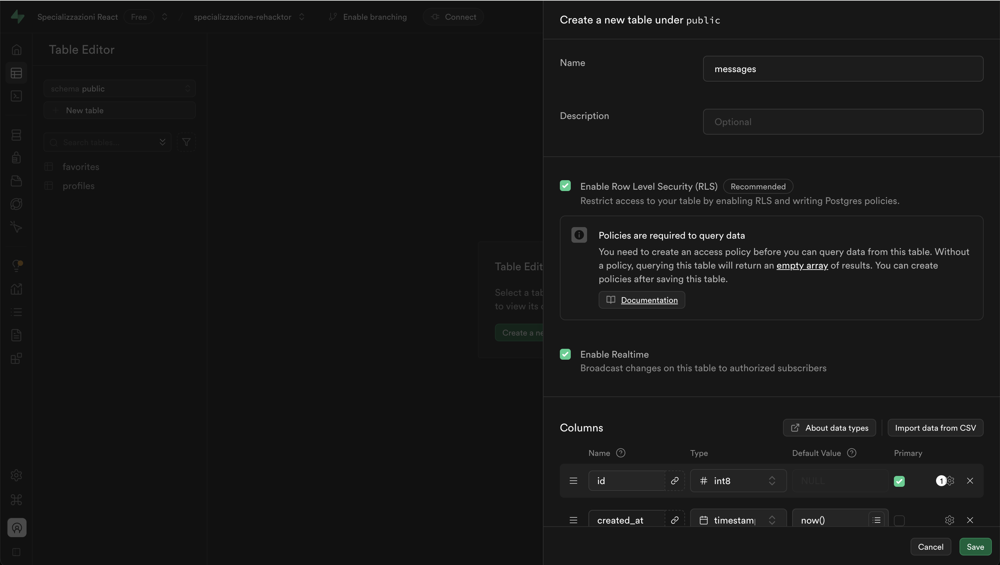
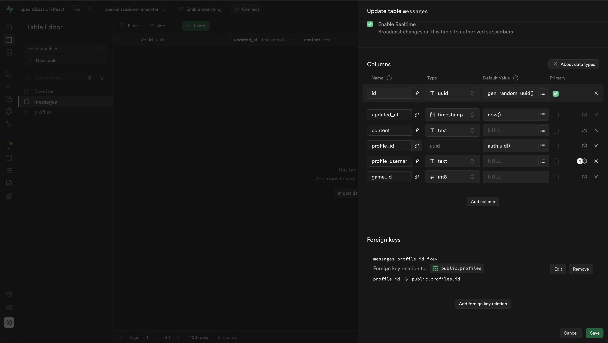
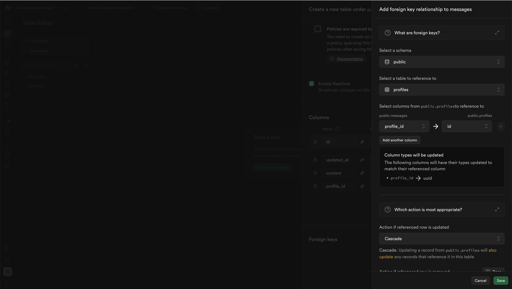
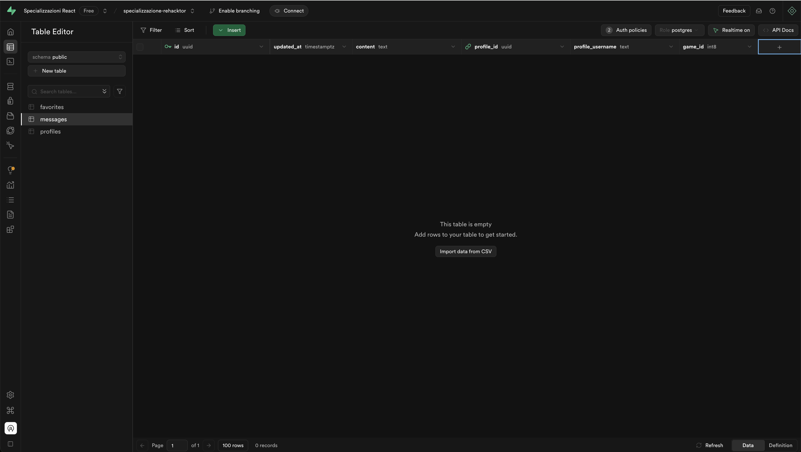
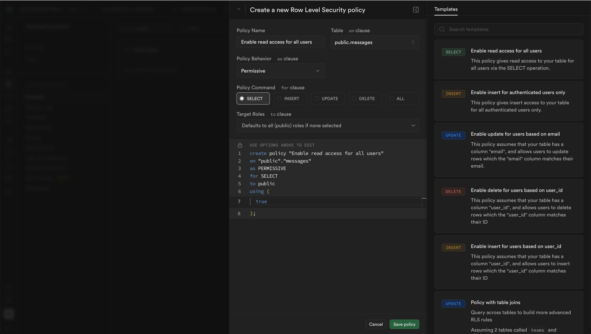
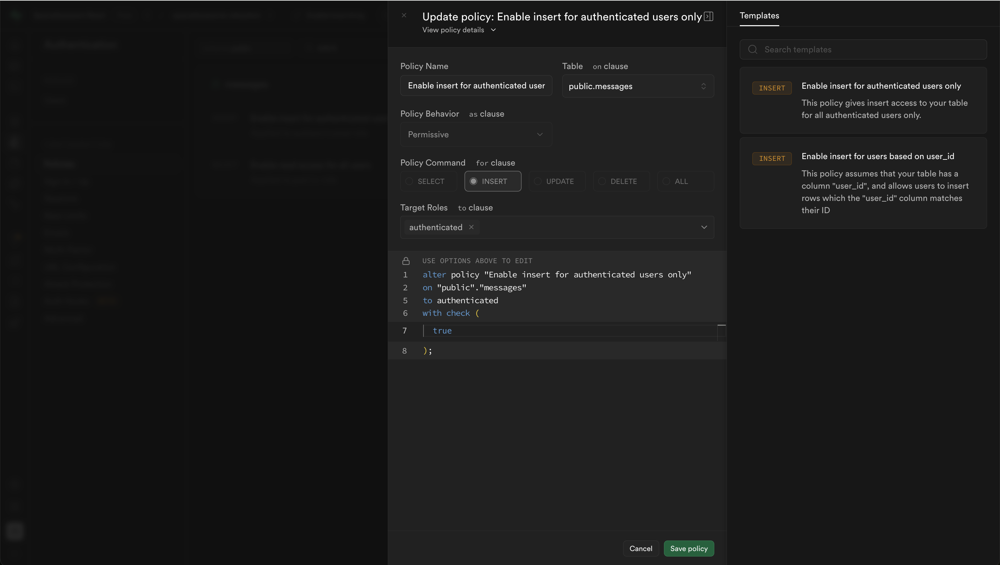
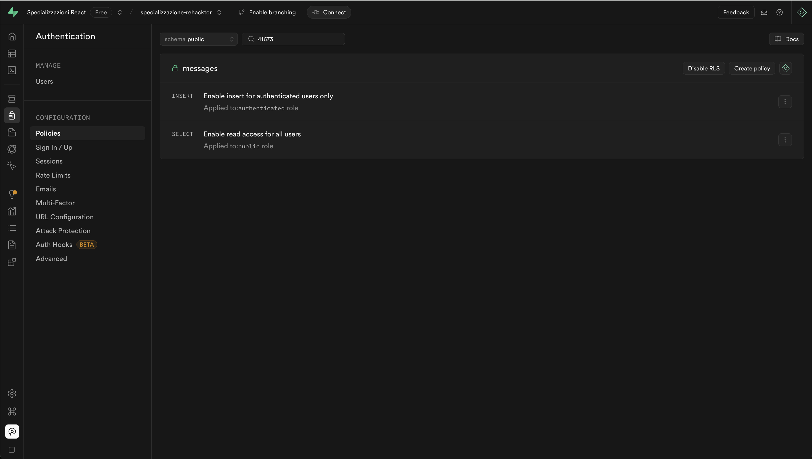
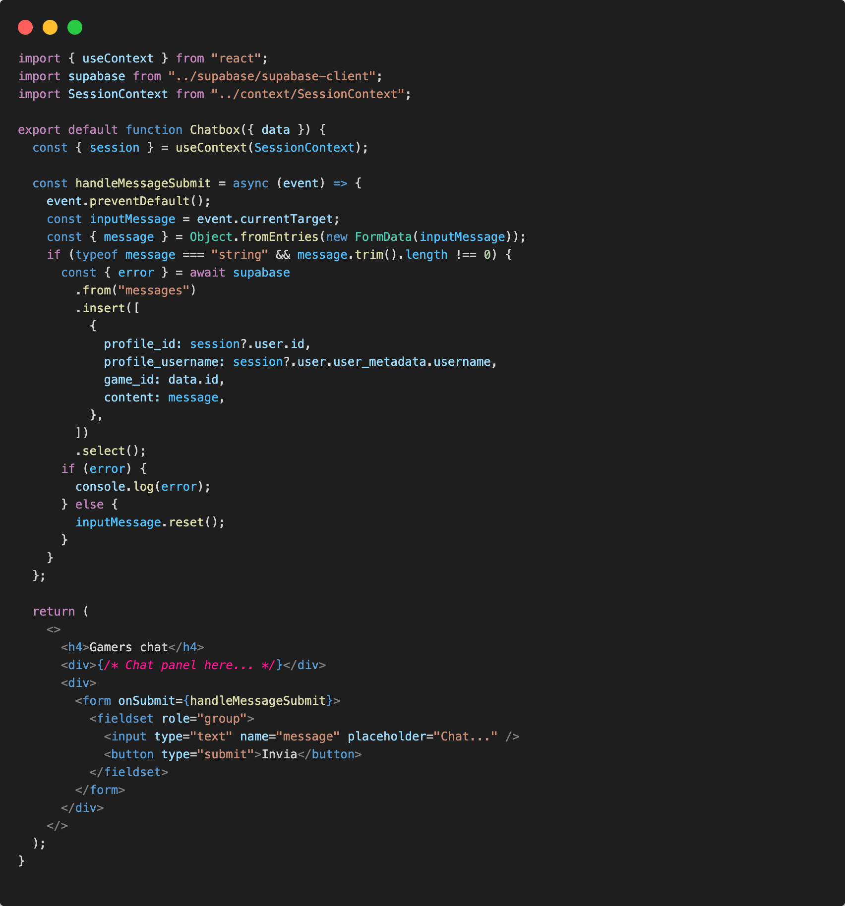
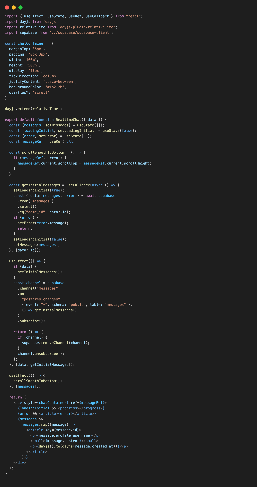

# Realtime Chat

Da questo momento consetiremo agli utenti autenticati di poter avere, per ogni gioco, una live chat forum per messaggiare in tempo reale con altri utenti autenticati e visitanti la piattaforma.

## Supabase messages table setup

Come primo passo avremo bisogno di una tabella nel database per salvare la lista dei messaggi lasciati dai nostri utenti.

Avremo bisogno di generere la tabella public.messages come abbiamo già fatto con public.profiles.

Assicuriamoci di proteggere sempre la tabella associata agli utenti abilitando Row Level Security (RLS) e facendo riferimento alla tabella auth.users per garantire l'integrità dei dati. Useremo on delete cascade per mantenere le relazioni coerenti.

Per ottenere tutto questo, useremo questa volta l'interfaccia grafica di supabase, nella sezione ```Table Editor``` usiamo il tasto ```create table```:



Abilitiamo (RLS) e Realtime.

### messages columns

Per le colonne della tabella messages sceglieremo le seguenti opzioni: 



- id: uuid not null
- updated_at: timestamps now() not null
- content: text not null
- profile_id: uuid auth.uid() not null
- profile_username: text
- game_id: int8 not null

Dopo aggiungeremo il vincolo referenziale con la tabella profiles.



dopo averlo definito clicchiamo su ```save```.

Il risultato sarà il seguente:



una nuova tabella messages, con i campi **id**, primary key, **updated_at**, **content**, **profile_id** foreign key, **profile_username**, **game_id**.

## messages authorization setup

Per autorizzare solo gli utenti autenticati l'inserimento di un messaggio, creeremo 2 policy molto semplici sulla nostra tabella messages

### Select policy (RLS)

In lettura consentiremo a tutti gli utenti di leggere i messaggi, creando ```Enable read access for all users```



### Insert policy (RLS)

In inserimento solo gli utenti autenticati potranno inserire un messaggio, creando
```Enable insert for authenticated users only```



### messages policies

Dopo aver salvato le policies:



## Chat component

Nella pagina gamepage/index.jsx è arrivato il momento di creare il form per l'inserimento del messaggi e un pannello per la loro visualizzazione in realtime con altri utenti auteniticati nella pagina di dettaglio del gioco.

A discrezione dello studente nel componente ```GamePage``` inseriamo il nuovo componente ```Chatbox``` che creeremo nella cartella /components:

Ad esempio in gamepage/index.jsx:

```jsx
<div className="style-chatbox">
  <Chatbox data={data && data} />
</div>
```

In ```Chatbox.jsx``` ricreeremo il form per l'inserimento del messaggio e useremo le api di supabase per l'insertimento del messaggio nel database al submit del form:



Adesso creeremo il panello per la visualizzazione dei messaggi ricevuti e inviati, sottoscrivendoci al canale messaggi attraverso le api di supabase per il realtime.

Useremo un nuovo componente ```RealtimeChat.jsx``` sempre creato nella cartella /components.

Richiamiamo il componente da usare in ```Chatbox.jsx```:

```jsx
<>
  <h4>Gamers chat</h4>
  <div>
    <RealtimeChat data={data && data} />
  </div>
  <div>
    <form onSubmit={handleMessageSubmit}>
      <fieldset role="group">
        <input type="text" name="message" placeholder="Chat..." />
        <button type="submit">Invia</button>
      </fieldset>
    </form>
  </div>
</>
```

In ```RealtimeChat.jsx```:



Nelle funzioni:

```getInitialMessages``` leggeremo dal database i messaggi della tabella messages filtrati per quel specifico gioco.

in ```useEffect``` avverrà la sottscrizione al canale messages, su tutti gli eventi, richiamando come payload la funzione ```getInitialMessages``` che si occuperà di aggiornare la nostra UI.

```scrollSmoothToBottom``` e ```dayjs``` sono solo funzioni di utilità e formattazione a discrezione dello studente.

🎉 Abbiamo completato il nostro panello di realtime chat usando le api realtime di supabase.

