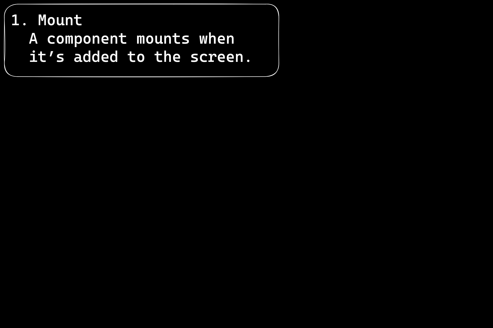
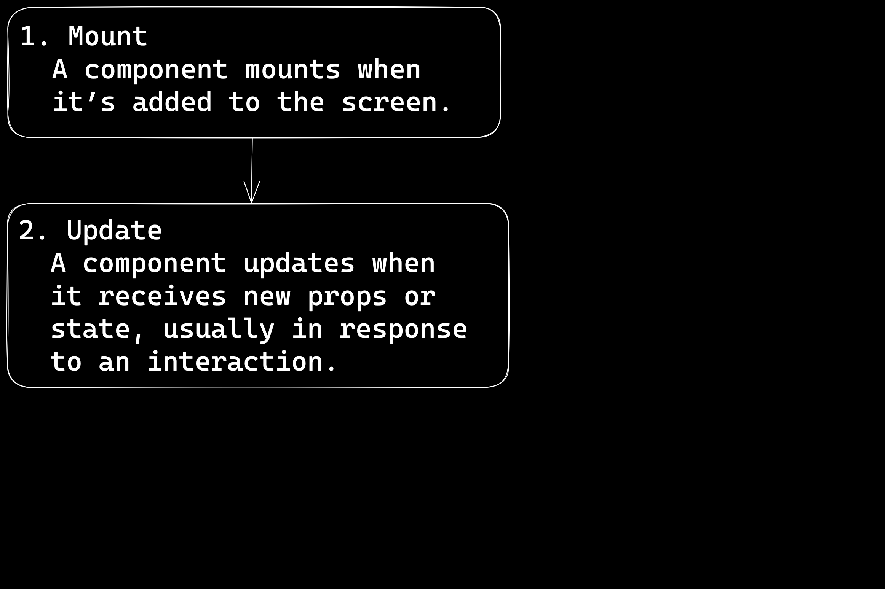
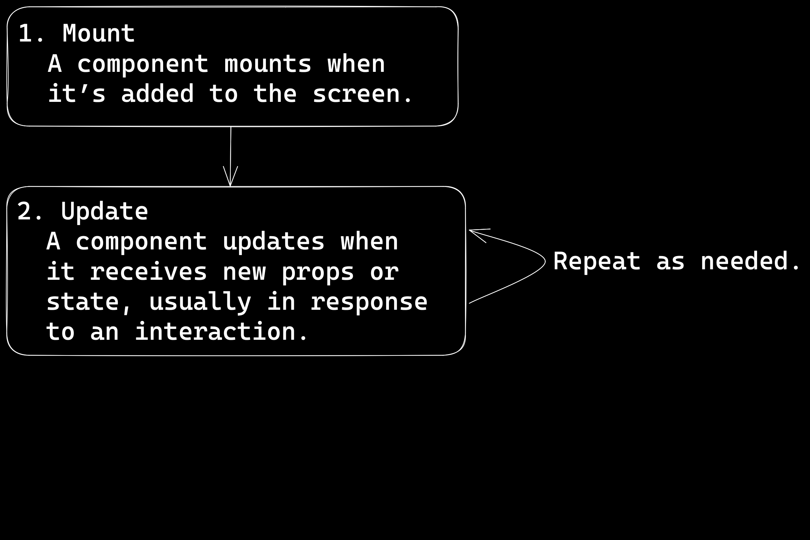
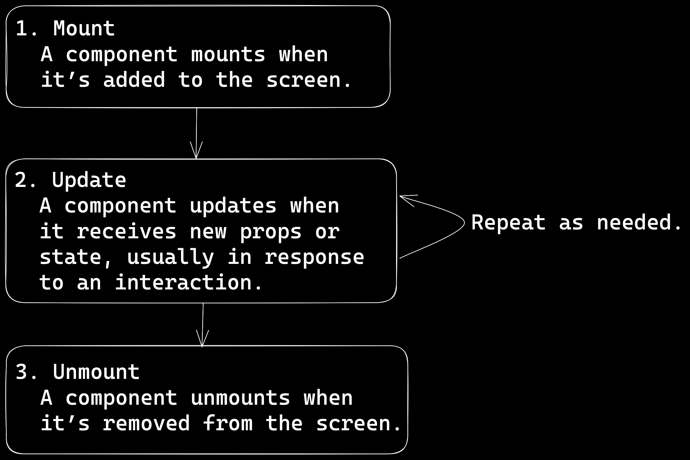

---
revealOptions:
  transition: 'fade'
---

---


<h3 class="r-fit-text">REACT MASTERCLASS</h3>

---

# Component Lifecycle, Hooks e Richieste API

---

## Obiettivi del modulo

* Descrivere come funciona React component lifecycle <!-- .element: class="fragment" -->
* Usare feature moderne React come useState e useEffect <!-- .element: class="fragment" -->
* Fare una chiamata API con React <!-- .element: class="fragment" -->
* Estrarre useEffect e useState in un hook custom riutilizzabile <!-- .element: class="fragment" -->

---

# Descrivere come funciona React component lifecycle

----

<div class="r-stack">
  
  
  
  
</div>

----

1. Mount <!-- .element: class="fragment" -->
1. Update - repete quando ne ha bisogno  <!-- .element: class="fragment" -->
1. Unmount <!-- .element: class="fragment" -->

----

# 2. Update

Ogni update avviene principalmente in 3 steps:

1. Trigger <!-- .element: class="fragment" -->
1. Render <!-- .element: class="fragment" -->
1. Commit <!-- .element: class="fragment" -->

----

# 2. Update

### Initial Render (Mount)

* Viene triggerato il primo Render - Primo montaggio <!-- .element: class="fragment" -->
* Rendering component - Nodi del DOM vengono creati <!-- .element: class="fragment" -->
* Consegna sul DOM - Gli elementi vengo aggiungi sul dom con appenChild <!-- .element: class="fragment" -->

----

# 2. Update

### Re-render (Update)

* Render viene triggerato - State / props vengono aggiornati <!-- .element: class="fragment" -->
* Rendering component - precise modifiche sul DOM vengono calcolate / determinate in base alle modifiche fatte <!-- .element: class="fragment" -->
* Consegna sul DOM - precise modifiche sul DOM vengono applicate sul DOM <!-- .element: class="fragment" -->

----

# 2. Update

1. Trigger
1. Render / Re-render
1. Commit

---

# Usare feature moderne React come useState e useEffect

----

## State

> In information technology and computer science, a system is described as stateful if it is designed to remember preceding events or user interactions; the remembered information is called the state of the system.  <!-- .element: class="fragment" -->

* Tutti i dati presenti sull applicazione in un determinato istante della sua vita <!-- .element: class="fragment" -->
* Lo state viene aggiornato ad ogni interazione dell'utente  <!-- .element: class="fragment" -->

----

## Immutable object

> An immutable object (unchangeable object) is an object whose state cannot be modified after it is created. This is in contrast to a mutable object (changeable object), which can be modified after it is created. <!-- .element: class="fragment" -->

* React usa immutable state per semplificare l'aggiornamento dello state <!-- .element: class="fragment" -->
* Per determinare se lo state o le props sono aggiornate, react usa shallow reference checks, non applica deep comparison <!-- .element: class="fragment" -->
* Immutable state ci permette questo <!-- .element: class="fragment" -->


----

## Shallow vs Deep

* Shallow copy significa che ( sub-valori o prop ) sono ancora connesse al dato originale <!-- .element: class="fragment" -->
* Deep copy significa che tutti i valori o prop sono totalmente disconnessi dal dato originale <!-- .element: class="fragment" -->


----

```js [1|2|4-5]
const personA = { name: 'NG' };
const personB = { name: 'NG' };

console.log(personA == personB); // Cosa appare in console??
console.log(personA === personB); // Cosa appare in console??
```

----

* personA e personB sono oggetti diversi <!-- .element: class="fragment" -->
* Vengono salvati in memoria separatamente <!-- .element: class="fragment" -->
* Per un confronto appopriato dobbiamo usare delle 'deep copies' <!-- .element: class="fragment" -->

```js [2|3|4|5]
function deepComparePerson(a, b) {
  // Sono questi entrambi oggetti?
  // hanno esattemente le stesse proprietá?
  // hanno esattemente gli stessi valori?
    // se il valore di una proprietá é un oggetto, abbiamo bisogno di effettuare una confronto deep allo stesso modo...
}
```
 <!-- .element: class="fragment" -->

* Questa cosa non é immediata, potrebbe indurre in errore se fatto manualmente, otre a consumare molta memoria computazionale <!-- .element: class="fragment" -->

----

## React é semplice

* In React non ci sono deep confronti tra gli state <!-- .element: class="fragment" -->
* Se un oggetto / state cambio riferimento... viene considerato un aggioramento <!-- .element: class="fragment" -->


----

## Aggiorare la proprietá di un oggetto

```js [1|2]
const person = { name: 'NG', favNumber: 42 };
person.name = 'Cool NG';
```

* Abbiamo mutato l'oggetto <!-- .element: class="fragment" -->

----

## Aggiorare la proprietá di un oggetto

```js [1|2]
const person = { name: 'NG', favNumber: 42 };
const nextPerson = { ...person, name: 'Cool NG' };
```

* Abbiamo creato una copia dell'oggetto <!-- .element: class="fragment" -->
* ... é spread syntax, copiano tutte le proprietá dell'oggetto in un nuovo oggetto <!-- .element: class="fragment" -->

----
React ci da accesso al valore precedente per utilizzarlo nei nostri aggiornamenti  

```js [1|3-8|5|3-8]
const [person, setPerson] = useState({ name: 'NG', favNumber: 42 });

const makeCool = () => {
  setPerson((prev) => ({
    ...prev,
    name: 'Cool NG'
  }));
};
```

----

# NON MUTARE LO STATE IN REACT 

----

## Side Effects

> In computer science, an operation, function or expression is said to have a side effect if it modifies some state variable value(s) outside its local environment, which is to say if it has any observable effect other than its primary effect of returning a value to the invoker of the operation.  <!-- .element: class="fragment" -->

[via Wikipedia](https://en.wikipedia.org/wiki/Side_effect_(computer_science))

----

<p class="text-9xl text-[#56bc58]">useEffect</p>

Effects ci consente eseguire un certo codice dopo il rendering in questo modo possiamo sincronizzare il componente con qualche sistema esterno a React (Browser APIs, API Requests, Socket Connections ecc...). <!-- .element: class="fragment" -->

---

# Fare una chiamata API con React

---

# Estrarre useState e useEffect code in un Hook custom riutilizzabile

---

# Obiettivi Recap

* Descrivere come funciona React component lifecycle 
* Usare feature moderne React come useState e useEffect 
* Fare una chiamata API con React 
* Estrarre useEffect e useState in un hook custom riutilizzabile 

